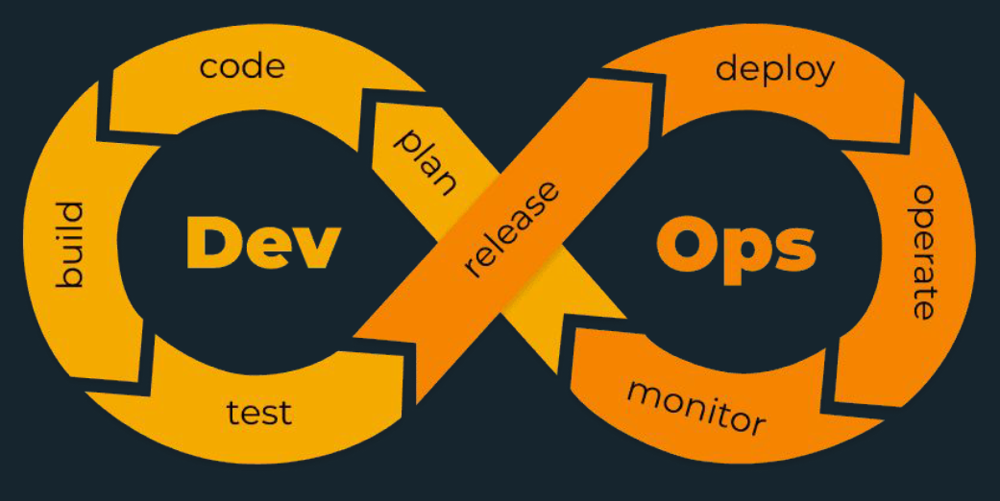

<h1 style="color: #E1BE5A;">DEVOPS BÁSICO</h1>

##### Professores: Fabrício Veronez e Marco Aurélio Souza Mangan.


>"Qualquer bom profissional de desenvolvimento
de software deve conhecer **paradigmas**.
>**<i>Alessandro Valério</i>**

<br>

## Ementa da disciplina

- Estudo de Arquitetura cliente-servidor para aplicações web SPAs (Single Page Applications).

- Introdução aos fundamentos de gerência de configuração
- Estudo sobre Integração contínua (CI).
- Utilização de contêineres
- ferramentas e ambientes direcionados ao desenvolvimento de software como:
  - Git
  - Github
  - Maven
  - Gradle
  - Npm
  - Yarn
  - GitHub Actions
  - Jenkins
  - Travis
  - Docker

------------

## Fundamentos

Como é visto processo de desenvolvimento de software ?

-   **Planejamento > Desenvolvimento > Testes > Implantação**
    <br>
-   O processo de desenvolvimento começa pelo planejamento com o levantamento dos requisitos.
    <br>

    >"<i>Tudo que um software precisa ter é feito na etapa de planejamento</i>"
    >Fabrício Veronez

    <br>
-   Após planejamento temos o desenvolvimento, no desenvolvimento pegamos os requisitos documentados e construimos o software
    <br>
-   Logo após temos os testes, aqui alguém testa todas as funcionalidades do sistema.
    <br>
-   Por último tempos a implantação, que é quando o software é disponibilizado para o usuário.


Um software nunca para de crescer, ele nunca para de ter novas funcionalidades. Nesse processo existem dois profissionais ativamente envolvidos neste processo:

-   Desenvolvedor - Dev
-   Profissional de Operação - OPS

Tanto os prifissionais de desenvolvimento quanto os de operações possuem características muito distintas.

**Caracteristicas:**

-   Dev
    -   Conhece profundamente programação
    -   Tem como objetivo entregar novos recursos
    -   conhecimento mínimo ou nulo de infraestrutura
    -   Não tem contato com o processo de execução do software em um ambiente de produção
-   Ops
    -   Conhece profundamente infraestrutura
    -   Tem como objetivo manter a solução estável
    -   Conhecimento mínimo ou bulo de programação
    -   Não tem contato com o processo de desenvolvimento e compilação do software.

Entre esses dois prifissionais existe um outro que é a junção do desenvolvedor e o profissional de infraestrutura : DevOps

-   **DevOps**
    -   Interesses em comum, foco no produto
    -   Comunicação ágil e simplificada
    -   O objetivo é sempre resolver o problema e aprender com ele
    -   3 maneiras:
        -   Fluxo
            -   Análise e otimização dos processos
            -   Inclusão de testes
            -   Integração contínua e deploy contínuo
            -   Entregas de baixo risco
        -   Feedback
            -   Implantar e coletar métricas
            -   Observabilidade
            -   Teste A/B
            -   Feedback dos resultados para replanejamento
        -   Aprendizado Contínuo e Experimentação
            -   Aprender com os erros
            -   Experimentação controlada
            -   Disseminar o conhecimento e padronizar o que deu certo.

><i>"A coisa básica que você precisa fazer para começar
>a trabalhar com devops é pensar na análise 
>e na otimização, dos processos"
>Fabrício Veronez</i>

 


## Boas práticas de dev para DevOps

#### Twelve Factor Apps
-   utilizar formatos declarativos para configuração de ambientes para facilitar automação
-   Garantir a maior portabilidade possível entre ambientes
-   Ter compatibilidade com plataformas de nuvem, sem depender do servidores e administração de sistemas
-   minimizar o impacto de migração entre ambientes de desenvolvimento e produção
-   Ser escalável sem alterações significativas

**1 - Base de Código (codebase)**
Cada aplicação possui uma base de código única e contralizada. Todos os deploys são reflexo da base de código.

**2 - Dependências (Dependencies)**
Declare as dependências das aplicações de forma explícita com gerenciadores de pacote

**3 - Configurações (Config)**
Armazene as configurações no ambiente

**4 - Backing servicees (Serviços de Apoio)**
Trate serviços como recursos

**5 - Construa, lance, execute (Build, release, run)**
Sepere os estágios de build e release dos projetos

**6 - Processos (processes)**
Execute a aplicação como um ou mais processos que não armazenam estado

**7 - Vínculo de Portas(Port binding)**
Utilizar port binding para expor serviços

**8 - Concorrência (Concurrency)**
Escale através do processo modelo

**9 - Descartabilidade (Disposability)**
Processos com rápida inicialização e encerramento gracioso

**10 - Paridade entre desenvolvimento e produção (Dev/prod parity)**
Mantenha o desenvolvimento, homologação e produção o mais similares possível

**11 - logs (Logs)**
Trate logs como fluxos de eventos

**12 - Processos administrativos (admin processes)**
Rode tarefas de administração / gestão em processos pontuais


##Versionamento de código
Para versionar código podemos usar o github que é um repositório git amplamente utilizado.

-   <a href="https://docs.github.com/en/get-started/quickstart/hello-world" target="_blank">Tutorial GitHub</a>


## Introdução à containers

Algo que gerá dúvida e enganos é considerar que container é de infra, containers são para desenvolvimento e facilitam muito o dia a dia.

#### Construção de software sem o uso de containers:

Antes da containerização das aplicações os profissionais de infra precisavam replicar o ambiente de desenvolvimento que estava no computador do desenvolvedor.
O método tradicional dificultava a migração das aplicações pois nem sempre o código era compatível no novo ambiente.
Como resultado dessa migração haviam as ocorrências de bugs, erros e problemas que demandavam correções que resultava em mais tempo "perdido".

#### Construção de software com o uso de containers:
Com o empacotamento de aplicações, basta migrar o container de uma plataforma para a outra e tudo permanece funcionando.
Isolamento de processos é uma ideia que exista a anos mas somente com a apresentação do Docker Engine pela Docker em 2013 é que se estabeleceu um padrão para o uso dos containers.

##### Benefícios
-   Leveza
-   Portabilidade

##### Containers vs máquinas virtuais.
-   Uma máquina virtual é um ambiente que funciona tal qual um computador físico, com sua própria CPU, memória, interface de rede e afins.
<br>
-   Conteinerização e virtualização são muitos semelhantes porque ambos possibilitam isolar totalmente as aplicações mas as diferenças estão no tamanho e potabilidade.
Containers são menores que máquinas virtuais e não contem nada maior que uma aplicação e seu ambiente de execução ao contrário das maquinas virtuais que podem abstrair, dividir, duplicar e emular servidores, sistemas operacionais, computadores e afins...

##### Containers vs microserviços
Containers podem ser usados para empacotar funcionalidades que executam tarefas específicas. Essas funcionalidades são chamadas de microserviços.
Microserviços são parte de uma aplicação maior dividida em serviços especializados.
Microserviços e containers foram feitos um para o outro.


-   <a href="https://docs.docker.com/" target="_blank">Docker: download - instalação - get started e outros</a>
-   <a href="https://learn.microsoft.com/pt-br/visualstudio/docker/tutorials/docker-tutorial" target="_blank">Tutorial: criar um app do Docker com visual studio Code(integrar vscode e docker)</a>

#### Usando docker.

-   Crie uma conta na docker
-   Faça download e instale docker desktop
-   Fazer login no docker desktop
-   Se correu tudo bem, segue o baile, Se não <a href="https://www.google.com" target="_blank">Google</a>
-   No prompt OU powershell:

-   Comandos de ajuda docker:

```powershell
docker --help
```

```powershell
docker run --help
```

```powershell
docker container --help
```

```powershell
docker container run --help
```

-   Cria e roda um container de uma imagem chamada hello-world
```powershell
docker container run hello-world
```

-   Lista os containers - somente os ativos / em execução
```powershell
docker container ls
```

-   Lista os containers - não ativos
```powershell
docker container ls -a
```


-   Cria e roda um container de uma imagem chamada hello-world - espscificando o nome do mesmo.
```powershell
docker container run --name meucontainer hello-world
```

-   Apaga o container chamado meucontainer
```powershell
docker container remove meucontainer
```

-   Renomeia o container chamado meucontainer para novo nome
```powershell
docker container rename meucontainer novo-nome-do-container
```

-   Cria e roda um container do ubuntu E acessa o terminal do mesmo
```powershell
docker container run -it ubuntu /bin/bash
```

-   Roda um container
```powershell
docker container start nome-do-container
```

-   executa o bash do container
```powershell
docker container exe -it palpatine /bin/bash
```

-   Encerra / desliga / para de rodar um container
```powershell
docker container stop nome-do-container
```

-   Remove todos os containeres parados / que não estão em execução - Precisa confirmar.
```powershell
docker container prune
```

-   Remove todos os containeres parados / que não estão em execução - Não solicita permissão / forma forçada - PERIGOSO
```powershell
docker container prune -f
```

-   roda container com ngnix - roda continuamente "'sequestrando' cursor do prompt"
    -   se sair o processo encerra.
```powershell
docker container run nginx
```

-   roda container com ngnix - roda continuamente "sem 'sequestrar' cursor do prompt"
  
```powershell
docker container run -d nginx
```

-   Para acessar o nginx(ou outro) na maquina e não no container é preciso fazer um port binding
    -   É um recurso onde vinculo uma porta da maquina local com uma porta do container rodando ngnix.
    -   Roda um container NOVO.
  
```powershell
docker container run -d -p 8080:80 nginx
```

-   Instalando mongodb com variáveis de ambiente (user e password)  
```powershell
docker container run -d -p 27017:27017 -e MONGO_INITDB_ROOT_USERNAME=mongouser -e MONGO_INITDB_ROOT_PASSWORD=mongopwd mongo
```

Para acessar o mongodb será preciso o download do studio 3t  que pode ser obtido em <a href="https://studio3t.com/download-studio3t-free/" target="_blank">https://studio3t.com/download-studio3t-free/</a>


#### Mais uso do docker

-   rodar docker container ubuntu com bash  
```powershell
docker container run -it ubuntu /bin/bash
```
**É possível criar imagens a partir de um arquivo de definição o mesmo é conhecido como Dockerfile**
-   criar dockerfile
    -   criar diretorio: mkdir ubuntu-curl (opcional)
    -   entrar no diretori: cd ubuntu-curl 
    -   abrir o vscode code . (ou outra ide)
    -   criar arquivo dockerfile

-   buildar / criar imagem
```powershell
docker build -t nome-que-deseja-para-imagem .
```

-   lista as imagens disponiveis
```powershell
docker image ls
```

-   executar imagem
```powershell
docker container run -it nome-do-container ( ex: aula-ubuntu-curl)
```

-  como criar imagem corretamente
```powershell
docker build -t seuUsuer/nome-que-deseja-para-imagem:v1 .
```
-   autenticar o docker hub
```powershell
docker login
```

-   subir a imagem para o docker hub
```powershell
docker push namespace/nome-imagem:versão
```

-   mudar a tag da imagem
```powershell
docker tag namespace/nome-da-imagem:versão namespace/nome-da-imagem:latest
```

-   mudar a tag da imagem
```powershell
docker tag namespace/nome-da-imagem:versão namespace/nome-da-imagem:latest
```

-   apagar TUDO do docker desktop
```powershell
docker system prune -a
```

-   baixar imagem do docker hub - se deixar versão em branco ele baixará sempre a latest
```powershell
docker container run -it namespace/nome-container:versão
```

#### rodar aplicação no docker
-   na pasta da aplicação criar dockerfile e seguir os passos anteriores
  
-   Subir a aplicação para o docker hub

#### baixar a aplicação e executar ela - Não esquecer de fazer port binding
```powershell
docker container run -i-d -p porta:porta namespace/nome-da-imagem
```

**OPÇÕES DE USO NO DOCKERFILE**
-   FROM 
    -   inicializa o build de uma imagem a partir de uma imagem base
-   RUN
    -   executa um comando
-   LABEL
    -   adiciona metadados a image
-   CMD
    -   define o comando e/ou os parâmetros padrão
-  EXPOSE
   -  define que o container precisa expor a porta em questão
-  ARG
   -  define um argumento para ser usado no processo de construção
-  ENV
   -  define variáveis de ambiente
-  ADD
   -  copia arquivos ou diretórios ou arquivos remotos e adiciona
-  COPY
   -  copia arquivos ou diretórios e adiciona ao sistema de arquivos da imagem.
-  ENTRYPOINT
   -  ajuda você a configurar um container que pode ser executado como um executável
-  VOLUME
   -  define volumes que devem ser definidos
-  WORKDIR
   -  define o seu diretório corrente.


#### Integração pipeline CI
é um conjunto de etapas sequenciais automatizadas que permitem a criação e implementação de código em um ambiente de produção.
a partir do commit do desenvolvedor passaremos por todas as etapas de validação e teste para incorporar o novo código numa nova versão da aplicação.

#### Criando uma pipeline

-   Acesso o github
-   Entre no repositório / projeto 
-   actions
-   new workflow
-   set up a workflow yourself
-   Exemplo de pipeline:


```javascript

# This is a basic workflow to help you get started with actions

name: CI


# Controls when the workflow will run

on:
  # Triggers the workflows on push or pull request events but only for the main branch

  push:
    branches: [ main ]
  pull_request:
    branches: [ main ]

  # Allows you to run this workflow manually frin tge actions tab
  workflow_dispatch:

# A workflow run is made up for onde or more jobs that can run sequentially or in parallel
jobs:
  # This workflow contains a single job called "build"
  build:
    # The type of runner that the job will run on
    runs-on: ubuntu-latest

    # steps represent a sequence of tasks that will be executed as part of the job
    steps:
      # Checks-out your repository under $GITHUB_WORKSPACE, as your job can access it

      - uses: actions/checkout@v2

      # Runs a single command using the runners shell
      - name: Run a one-line  script
        run:  echo Hello, world!

      #Runs a set of commands using the runners shell

      - name: Run a multi-line script
        run:  |
          echo Add other actions to build,
          echo test, and deploy your project.

```

-   Outro exemplo de pipeline
  
  ```javascript

  # This is a basic workflow to help you get started with actions

name: CI


# Controls when the workflow will run

on:
  # Triggers the workflows on push or pull request events but only for the main branch

  push:
    branches: [ main ]


  # Allows you to run this workflow manually frin tge actions tab
  workflow_dispatch:

# A workflow run is made up for onde or more jobs that can run sequentially or in parallel
jobs:
  # This workflow contains a single job called "build"
  CI:
    # The type of runner that the job will run on
    runs-on: ubuntu-latest

    # steps represent a sequence of tasks that will be executed as part of the job
    steps:
      # Checks-out your repository under $GITHUB_WORKSPACE, as your job can access it

      - uses: actions/checkout@v2

      - name: Setup nodeJS
        uses: actions/setup-node@v3.8.1
        with:
          node-version: 18.17.1
          
      - name: Instalação do Mocha e dos pacotes para teste
        run: |
          cd src
          npm install -g mocha;
          npm install
      
      - name: Execução do teste
        run: mocha src/test/convert.js

      - name: construção da imagem docker
        # You may pin to the exact commit or the version.
        # uses: docker/build-push-action@2eb1c1961a95fc15694676618e422e8ba1d63825
        uses: docker/build-push-action@v4.1.1
        with:
          context: .
          file: ./src/Dockerfile
          push: true
          tags: |
            luizfg00/aula-conversao-temperatura:v1
            luizfg00/aula-conversao-temperatura:latest
  
  ```