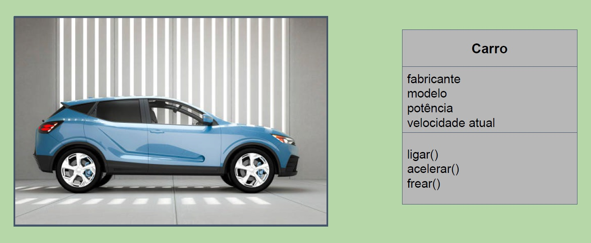
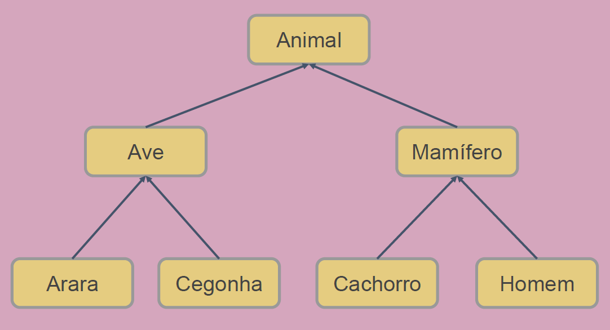
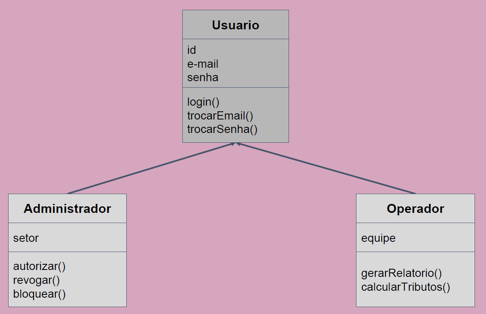
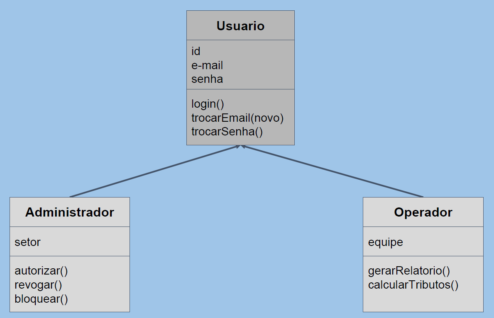
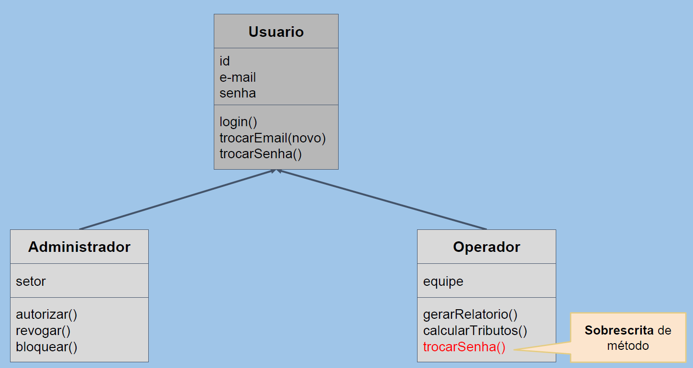
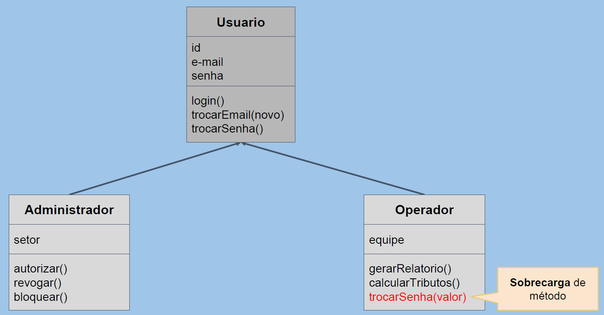

<h1 style="color: #E1BE5A;">PROGRAMAÇÃO  ORIENTADA A OBJETOS</h1>

##### Professores: Alessandro Valério e Edson Ifarraguirre Moreno.

>"Não adianta você ser um bom programador,
>mas você não saber o que o **<i>mercado</i>** precisa.
>**<i>Juliana Remor</i>**

 

## Ementa da disciplina

- Estudo sobre conceitos de Classes (atributos, métodos, propriedades, visibilidade, instancia ou classe).

- Estudo de conceitos de Herança, Polimorfismo, Interfaces, Genéricos e Arrow functions.

- Estudo sobre funções de filtragem, mapeamento e redução.
  
- Estudo sobre construtores de tipos.

------------

A programação Orientada a Objetos(POO) é um paradigma de programação com foco em objetos, ao invés de funções.
Ainda, a POO não pode ser considerada uma linguagem de programação, tampouco um ferarmenta ou um framework. É, na verdade
um estilo de programação.
São diversas as linguagens de programação que implementam a orientação a objetos, como:
-   C++
-   C#
-   Java
-   Javascript
-   Python
-   e Ruby

## Conceitos I

#### Programação estruturada
Surgida nos anos 1940, com as primeiras linguagens de caráter algorítmico, as quais visavam resolvar problemas
especificos, é um paradigma com foco em sequência (de itens, comandos, dados...), em decisão (testes lógicos)
e em iteração (repetição);

#### Programação procedural
Paradigma com foco no uso de procedimentos e funções para facilitar o reuso, estão não só nos elementos da programação estruturada, mas um conjunto de funções.
O maior dilema da programação estruturada e da programação procedural é que o elevado número de funções, em meio às quais não há qualquer senso de pertencimento, e a falta de isolamento de alguns dados gerou uma série de problemas.
havia muito interdependência de funções, muito "copia e cola", as mudanças em uma função resultavam em mudanças em outras funções...

## Conceitos II

#### Programação Orientada a Objetos
Trafa-se de um paradigma com foco no uso de objetos, em que cada um contém suas próprias variáveis, funções (métodos) e conjuntos de dados (atributos). Esses objetos, uma construção a partir da qual podemos criar elementos semelhantes, possuem uma série de componentes:
um nome único, atributos/variáveis e comportamentos/métodos.

#### Objeto
Um objeto pode ser definido como uma coleção de dados e/ou funcionalidades com alguma relação entre si. Vale sublinhar que dados, variáveis, atributos e propriedades podem ser
considerados sinônimos no contexto de programação orientada a objetos.

#### Atributo ou propriedade
Trata-se de um ou mais dados que estão presentes em um objeto. Os atributos e propriedades possuem um nome único e armazenam um valor ou uma referência.

#### Acesso e atribuição
O acesso às propriedades ou atributos de um objeto se dá por meio do comando nomeObjeto.nomePropriedade. 
O acesso aos vetores, por sua vez, se dá pelo comando **<i>nomeObjeto[“nomePropriedade”]</i>**.
Para mudar o valor de uma propriedade, é preciso executar uma atribuição, que pode ser feita de duas formas:
**<i>nomeObjeto.nomePropriedade = algo</i>**, ou **<i>nomeObjeto[“nomePropriedade”] = algo</i>**.

#### Métodos
O método representa uma ou mais funcionalidades presentes em um objeto.
Assim como atributos, os métodos possuem nome único. Álem disso, representam também uma lógica pertinente ao objeto.
A única forma de acessar um método é por meio do comando nomeObjeto.metodo(). Se houver parâmetros, usa-se nomeObjeto.metodo(parametro).
Assim como no caso das propriedades, podemos mudar um método através da atribuição.

## Pilares da Programação Orientada a Objetos

#### Encapsulamento

- Permitir que atributos e métodos sejam **agrupados** de certa forma em uma **interface bem definida** para manipular os dados de um objeto de forma eficiente.
- **Isolamento** entre partes de um programa.
- Saber *o que um objeto faz* e não como ele faz
- **Proteção** de atributos.

~~~~javascript
//Exemplo de encapsulamento

const empregado = {
    salarioFixo: 5000,
    valorHoraExtra: 100,
    horasExtras: 20,
    calculaSalario: function()
    {
        return this.salarioFixo + (this.valorHoraExtra * this.horasExtras);
    }
};

console.log(empregado.calculaSalario());
~~~~

#### Abstração

- POO é **amplamente baseada** na abstração digital da vida real.
- **Objetos** são representações/abstrações do que queremos implementar do que observamos no mundo ao nosso redor.
- Buscamos o **essencial** e deixamos de lado o que não importa, <u>focamos no que realmente precisamos representar em nossos objetos.</u>

#### Herança

-   Permite o **compartilhamento** de atributos e métodos entre objetos.
-   <u>Reaproveita código</u> e <u>agrupa o que é comum</u> a diferentes objetos.
-   Busca identificar e agrupar **comportamentos generelizados** ou **especializados**
-   Ajuda a eliminar **redundâncias**

#### Polimorfismo
- Através da <u>herança</u> é possível **alterar um comportamento herdado** de um objeto-pai.

- Permite uma forte <u>separação de interesses</u>

- <u>Limpeza de código,</u> removendo lógica excedente.

##### Sobrescrita
Métodos com o <u>mesmo nome e assinatura</u> **em diferentes objetos** relacionados por **herança**

##### Sobrecarga
Métodos com o <u>mesmo nome</u> mas **diferentes assinaturas em diferentes objetos** relacionados por **herança**
<h1 style="color:red;">Javascript Não suporta sobrecarga</h1>

  

|  Conceitos  | Vantagens e Ganhos  |
| ------------ | ------------ |
|Encapsulamento   |Redução de complexidade / Proteção de dados|
|Abstração   |Redução de complexidade / Maior reuso|
|Herança   |Eliminar redundâncias no código|
|Polimorfismo   |Eliminar lógica desnecessária no código|

