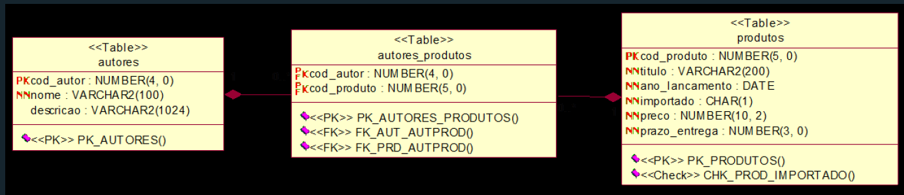

<h1 style="color: #E1BE5A;">BANCO DE DADOS<br> RELACIONAL</h1>

##### Professores: Claudio Bonel e Azriel Majdenbaum.


> "Relações são conjuntos onde os
> elementos **<i>são pares ordenados.</i>**
> **<i>Daniela Rodrigues</i>**

<br>
## Ementa da disciplina

- Visão geral da abordagem de banco de dados.

- Estudo sobre modelagem conceitual (E/R).

- Estudo sob mapeamento objeto relacional (ORM).

- Desenvolvimento com SQL padrão (DDL e DML).

------------

## Banco de dados
Um banco de dados relacional é um tipo de banco de dados que armazena e fornece acesso a pontos de dados relacionados entre si. Bancos de dados relacionais são baseados no modelo relacional, uma maneira intuitiva e direta de representar dados em tabelas. Em um banco de dados relacional, cada linha na tabela é um registro com uma ID exclusiva chamada chave. As colunas da tabela contêm atributos dos dados e cada registro geralmente tem um valor para cada atributo, facilitando o estabelecimento das relações entre os pontos de dados.


#### Sistema de Gerenciamento de Banco de dados (SGBD)
Data Base Management System ou Sistema de Gerenciamento de Banco de Dados (SGBD) é um conjunto de software utilizado para o gerenciamento de uma base de dados, responsáveis por controlar, acessar, organizar e proteger as informações de uma aplicação, tendo como principal objetivo gerenciar as bases de dados utilizadas por aplicações clientes e remover esta responsabilidade das mesmas.


#### Exemplos de SGBDs:
-   Microsoft SQL Server
-   Azure SQL DB
-   Oracle
-   MySQL
-   PostgreSQL
-   SQLite
-   IBM DB2

#### Metadados
São informações descritivas de um banco de dados, normalmente, chamamos de "dados sobre dados". "Meta" vem do grego e significa "Além de".

-   Em um banco de dados, tem por objetivo descrever os objetos
  
 

#### Tipo de dados

-   INT
    -   Numeros inteiros

-   DECIMAL / FLOAT / REAL
    -   Armazena números decimais, com precisão definida.
        EX: DECIMAL(10,2), armazena até 10 numeros ao lado esquerdo da virgula e 2 casas decimais.
-   CHAR
    -   Texto fixo.
        EX: CHAR(4), será uma coluna que armazenará necessáriamente 4 caracteres.
-   VARCHAR
    -   Texto Variável.
        EX: VARCHAR(255), será uma coluna que armazenará até 255 caracteres.
-   DATE
    -   Armazena data.
-   DATETIME
    -   Armazena data e hora.

Existem outros tipos de dados, além dos listados acima.

#### Modelo de dados
Modelagem de dados é o processo de criar uma representação visual, ou esquema, que define os sistemas de coleta e gerenciamento de informações de qualquer organização. Esse blueprint ou modelo de dados ajuda diferentes partes interessadas, como analistas de dados, cientistas e engenheiros, a criar uma visão unificada dos dados da organização. O modelo descreve quais dados a empresa coleta, a relação entre diferentes conjuntos de dados e os métodos que serão usados para armazenar e analisar esses dados.

-   Cardinalidade:
    -  Indica o total de ocorrências que uma determinada entidade possui com outra. 
    Existem três tipos de variações, são:
       -   n: quando a variação ocorre várias vezes;
       -   1: quando a variação ocorre apenas uma única vez;
       -   0: quando não ocorre variação.


 

#### Constraints (restrições)
 São usadas para garantir a exatidão e consistência dos dados do bd, possuem o objetivo de limitar os tipos de dados inseridos numa tabela.
 Constraints são aplicadas as colunas de uma tabela, podendo ser especificadas na criação da tabela ou posteriormente.

##### Principais constraints
-   NOT NULL
    -   Não aceita valores nulos na coluna
    -   obriga campos a possuirem um valor.
-   UNIQUE
    -   Unicas por registro na tabela
    -   pode existir mais de uma por tabela
    -   permitem valores nulos
-   PRIMARY KEY
    -   só existe uma por tabela
    -   não aceita valores nulos(null)
    -   única e o principal modo de relacionar tabelas no banco de dados
-   FOREIGN KEY
    - são primary key em outra tabela
    - chamada de tabela filho, a tabela mãe é aquela que possui a PK(primary key)
    - evita que links entre tabelas sejam destruidos   
-   DEFAULT
    -   define um valor padrão para uma coluna
    -   o valor padrão é adicionado a todos os novos registros se nenhum outro valor for adicionado.
    -   pode inserir valores do sistema, usando funções como GETDATE()


##### INDEX - <span style="color:red;">Não é considerado uma constraint</span>
  - pode ser aplicado a qualquer coluna da tabela
  - agiliza a recuperação de dados
  - pode ser aplicado em mais de uma coluna(não existe restrição quanto a quantidade)
  - qualquer coluna pode ser indexada, coluna chave ou não.
  - 

## Manipulação básica de dados I

##### Criar tabela <br>para criar uma tabela usamos o comando CREATE TABLE.

```SQL
CREATE TABLE nome_da_tabela
(
    nome_dacoluna1  tipo_de_dado    [NULL | NOT NULL],
    nome_dacoluna2  tipo_de_dado    [NULL | NOT NULL],
    nome_dacoluna2  tipo_de_dado    [NULL | NOT NULL],
...
constraints ...
);
```
**OBS:** os elementos entre colchetes são opcionais.
Servem para dizer, para cada coluna se o seu dado é obrigatório( NOT NULL) ou opcional (NULL).
Este conceito será explorado mais adiante assim como as constraints.

```SQL
CREATE TABLE VEICULOS
(
    placa   CHAR(8),
    ano     NUMBER(4),
    km      NUMBER(6),
    marca   VARCHAR(50),
    modelo  VARCHAR(50) -- REPARE que o último elemento não leva virgula.
);
```
Tipos de dados do exemplo anterior
-   CHAR(tamanho)
    -   Sequência de caracteres de tamanho único.
    -   EX: "ABC1A99".
-   NUMBER(total, decimais)
    -   Armazena um valor, com ou sem decimais.
    -   EX: 2014.
-   VARCHAR(tamanho)
    -   Sequência de caracteres de tamanho variável.
    -   EX: "Sou uma frase e tenho 35 caracteres".
        -   espaço é considerado um caractere.

##### Inserir dados<br> para inserir dados em tabelas usamos o comando INSERT INTO.

```SQL
INSERT INTO nome_da_tabela [(colunas)]
VALUES (valores);
```

EX 1:
```SQL
INSERT INTO VEICULOS
VALUES ('IJK-1212', 2022, 0, 'Chevrolet', 'Onix');
```

EX 2:
```SQL
INSERT INTO VEICULOS (placa, ano, km, marca, modelo)
VALUES ('IJM-1556', 2015, 72045, 'Volkswagem', 'Gol');

-- Repare o uso de aspas simples para textos.
-- Repare também na especificação das colunas no segundo caso.
```

##### Consultar dados<br> para consultar dados em tabelas  usamos o comando SELECT.

```SQL
SELECT coluna1, coluna2, ...
FROM nome_da_tabela
[WHERE condição];
```

EX 1:
```SQL
SELECT *
FROM nome_da_tabela;
-- O asterisco significa que o select deve retornar todos os registros da tabela
```
EX 2:
Podemos também aplicar filtros nas linhas e colunas usando uma ou mais condições.
Para isso usamos o comando WHERE(quando)

```SQL
SELECT placa, ano
FROM VEICULOS
WHERE km = 0;
```

EX 3:
```SQL
SELECT placa, ano, modelo
FROM VEICULOS
WHERE ano < 2022;
```

##### Atualizar/alterar dados<br> para atualizar / alterar / editar noSql usamos o comando UPDATE:

EX :
Iremos zerar a km todos os veiculos com menos de 10km rodados.
```SQL
UPDATE VEICULOS
SET KM = 0
WHERE KM < 10;
```
Verifique como ficou usando o comando abaixo:
```SQL
SELECT *
FROM VEICULOS;
```
Cuidado pois se não existirem condições as alterações serão aplicadas a todos os registros da tabela.
Portanto PRESTE ATENÇÃO para não rodar comandos sql sem WHERE.

EX 1:
```SQL
UPDATE VEICULOS
SET modelo='Cruze'
WHERE placa='IJK-1212';
-- WHERE significa quando.
-- LOGO a sintaxe sql acima é: atualize o modelo do veiculo QUANDO A placa for igual a: 'IJK-1212'
```

Podemos usar também expressões aritméticas e lógicas (V/F).
Exemplos:
```SQL
SELECT com preco * 2
UPDATE com x = x + 10
UPDATE com preco = preco * 1.1
SELECT e WHERE com idade > 18
SELECT e WHERE com idade > 18 AND peso < 80
SELECT e WHERE com idade <> 18
```

EX 2:
Experimente escrever o comando UPDATE para somar 100 quilômetros a todos os veículos cujos anos estão entre 2015 e 2021 (inclusive).

```SQL
UPDATE VEICULOS
SET KM = KM + 100
WHERE ano BETWEEN 2015 AND 2021;
```

##### Excluir dados <br> para excluir dados da tabela usamos o comando DELETE:

```SQL
DELETE FROM nome_da_tabela
[WHERE condicao];

-- repare novamente que é a cláusula WHERE que especifica quais registros devem ser excluidos.
-- sem WHERE todos os registros da tabela serão apagados mas a tabela continuará existindo.
```

EX 1:
```SQL
DELETE FROM VEICULOS
WHERE placa ='IJM-1556';
```

EX 2:
Experimente agora excluir todos os veículos da marca Chevrolet que possuem mais de 50.000 KM.

```SQL
DELETE FROM VEICULOS
WHERE (marca ='Chevrolet') AND (km >50000);
-- O uso do parentese não é obrigatório mas facilita a leitura do comando.
```

##### Ordenar<br> para ordenar retorno dos registros da tabela usamos o comando ORDER BY:

```SQL
SELECT coluna1, coluna2, ...
FROM nome_da_tabela
[WHERE condição]
ORDER BY coluna1[ASC | DESC], coluna2[ASC | DESC]…
```

Usamos ASC para ordenar em ordem ascendente e DESC para ordenar em ordem descendente.
| ASC  | DESC  |
| :------------: | :------------: |
| Menor para Maior  | Maior para Menor  |
| A - Z  |Z - A  |

EX 1:
```SQL
SELECT placa, km
FROM VEICULOS
ORDER BY km;
```
EX 2:
```SQL
SELECT placa, km
FROM VEICULOS
WHERE ano > 2000
ORDER BY km DESC;
```

Também existe a possibilidade de ordenar por mais de uma coluna
```SQL
SELECT marca, modelo
FROM VEICULOS
ORDER BY marca DESC, modelo ASC;
```

##### Função de agregação <br> para retornar a quantidades de linhas de uma consulta usamos o comando COUNT:
```SQL
SELECT COUNT(*)
FROM VEICULOS;
```
EX:
Para saber quantos veículos zero-KM temos na tabela VEICULOS podemos usar:
```SQL
SELECT COUNT(*)
FROM VEICULOS
WHERE km = 0;
```

EX 1:
quantos veículos da marca Ford estão cadastrados no banco de dados.
```SQL
SELECT COUNT(*)
FROM VEICULOS
WHERE marca = 'Ford';
```

##### Evitar duplicatas<br> para sabermos por exemplo as marcas de veiculos registras na tabela sem repetir sua ocorrencia usamos DISTINCT:
```SQL
SELECT DISTINCT marca
FROM VEICULOS;
-- irá retornar 1 ocorrência para cada marca cadastrada na tabela.
```

## Manipulação básica de dados II

##### Valores nulos
Quando criamos uma tabela podemos definir para cada campo se ele é obrigatório ou não.
Para indicar se um campo é obrigatório usamos NOT NULL e para indicar um campo de conteúdo opcional usamos NULL.
Na linguagem SQL o padrão é NULL(campo opcional).

EX:
```SQL
CREATE TABLE PESSOAS
(
    cpf      VARCHAR(20)  NOT NULL,
    nome     VARCHAR(150) NOT NULL,
    idade    NUMBER(3)    NULL,
    endereco VARCHAR(150) -- O campo endereco é NULL implicitamente.
);
```

Para inserir registros podemos especificar cada um dos campos da tabela(e inclusive sua ordem).

EX:
Ordem normal das colunas
```SQL
INSERT INT PESSOAS (cpf, nome, idade, endereco)
VALUES('32809', 'Maria', 25, 'Rua A, 20');
```

EX 1:
Outra ordem qualquer das colunas
```SQL
INSERT INTO PESSOAS(idade, endereco, cpf, nome)
VALUES(25, 'Rua A, 20', '30599', 'Pedro');
```

EX 3:
Valores nulos
```SQL
INSERT INTO PESSOAS(cpf, nome, idade, endereco)
VALUES ('29385', 'Carlos', NULL, NULL);
```

```SQL
INSERT INTO PESSOAS(cpf, nome, idade, endereco)
VALUES ('39582', 'Alice', 80, NULL);
```

```SQL
INSERT INTO PESSOAS(cpf, nome, idade, endereco)
VALUES ('78838', 'Antonio', NULL, 'Rua B, 80');
```

OU podemos omitir alguns dos campos e neste caso o valor NULL é implicito.

```SQL
INSERT INTO PESSOAS(cpf, nome)
VALUES ('90038', 'Ana Paula');

INSERT INTO PESSOAS(cpf, nome, idade)
VALUES ('23487', 'Patricia', 18);

INSERT INTO PESSOAS(cpf, nome, endereco)
VALUES ('23363', 'Jose', 'Rua C, 50');
```

PARA PESQUISARMOS por valores nulos não podemos utilizar o operador de igualdade convencional(=). Devemos usar os operados especiais IS NULL ou IS NOT NULL.

EX:
Pessoas sem especificação de idade
```SQL
SELECT *
FROM PESSOAS
WHERE idade IS NULL;
```

EX 1:
PEssoas que forneceram algum endereço
```SQL
SELECT *
FROM PESSOAS
WHERE enderecoIS NOT NULL;
```

#### Localizar textos<br>O operador LIKE é usado para localizar textos.<br> O símbolo '%' substitui zero ou mais caracteres.

EX:
Pessoas com nomes iniciando com a letra 'A'
```SQL
SELECT *
FROM PESSOAS
WHERE nome LIKE 'A%';
```

EX 1:
Pessoas com nomes iniciando com 'Ana'
```SQL
SELECT *
FROM PESSOAS
WHERE nome LIKE 'Ana%';
```

EX 2:
Pessoas com nome que terminam com 'Silva'
```SQL
SELECT *
FROM PESSOAS
WHERE nome LIKE '%Silva';
```

EX 3:
Pessoas com nomes que contenham 'Carlos'
```SQL
SELECT *
FROM PESSOAS
WHERE nome LIKE '%Carlos%';
```

O símbolo `_` substitui exatamente um caractere.
```SQL
SELECT *
FROM PESSOAS
WHERE nome LIKE 'Mari_ da Silva'; --Pode corresponder a Maria ou Mario
```

O operador IN determina se um valor corresponde a qualquer um dos valores de uma lista:
```SQL
SELECT *
FROM PESSOAS
WHERE idade IN (25, 30, 40);
-- Pessoas que tenham 25, 30 ou 40 anos de idade
```

#### Removendo ou adicionando colunas em tabelas<br> Para adicionar ou remover uma coluna de uma tabela precisamos alterar sua estrutura OU SEJA, alterar a tabela e não somente os dados contidos nela, e para isso, usamos o comando ALTER TABLE

EX:
Para remover uma coluna da tabela usamos o comando ALTER TABLE com a cláusula DROP COLUMN

```SQL
ALTER TABLE PESSOAS
DROP COLUMN idade;
```
EX 1:
Para adicionar uma nova columa em uma tabela usamos o comando ALTER TABLE com a cláusula ADD

```SQL
ALTER TABLE PESSOAS
ADD sexo CHAR(1);
```

#### Manipulando datas.
Ao criar uma tabela é uma pratica ruim criar a coluna idade pois a mesma necessita ser atualizada anualmente.
Uma escolha melhor teria sido criar a coluna como data de nascimento.

EX:

maneira incorreta
```SQL
CREATE TABLE PESSOAS
(
    cpf      VARCHAR(20)  NOT NULL,
    nome     VARCHAR(150) NOT NULL,
    idade    NUMBER(4)    NULL,
    endereco VARCHAR(150) NULL
);
```
Maneira Correta
```SQL
CREATE TABLE PESSOAS
(
    cpf      VARCHAR(20)  NOT NULL,
    nome     VARCHAR(150) NOT NULL,
    datanasc DATE         NULL, -- Alterado de idade para datanasc
    endereco VARCHAR(150) NULL
);
```
Utilizando comandos para alterar a tabela, vamos modificar sua estrutura para substituir idade por data de nascimento:

```SQL
ALTER TABLE PESSOAS
DROP COLUMN idade;

ALTER TABLE PESSOAS
ADD datanasc DATE NULL;
```


#### Inserindo dataas em campos DATE
O formato padrão varia conforme a instalação do SGBD.
SUpondo que o formado seja DD-MON-YYY, temos um dia com 2 dígitos, as 3 primeiras letras do mês e o ano com 4 digitos.

EX:
```SQL
INSERT INTO PESSOAS(cpf, nome, datanasc, endereco)
VALUES ('29048', 'Roberto', '03-FEB-1980', 'Rua D, 80');
```

EX 1:
```SQL
--Formato alternativo (padrão ANSI YYYY-MM-DD):
--Deve-se acrescentar a palavra DATE antes da data.
INSERT INTO PESSOAS(cpf, nome, datanasc, endereco)
VALUES ('29048', 'Roberto', DATE'1980-02-03', 'Rua D, 80');
```

#### Funções de conversão de datas.
A função TO_CHAR() e TO_DATE() covertem uma data/horário em uma string e vice-versa.
A sintaxe é:
TO_CHAR(X [, formato]) e TO_DATE(x [, formato]).
O elemento SYSDATE captura data e horas atuais.

```SQL
SELECT TO_CHAR(SYSDATE, 'MONTH, DD, YYYY HH24:MI:SS')
FROM DUAL;
--DUAL é uma tabela interna do Oracle usada com o comando SELECT quando não precisamos de uma tabela real do banco de dados.
SELECT nome, TO_CHAR(datanasc, 'MONTH, DD, YYYY')
FROM PESSOAS;
```

```SQL
INSERT INTO PESSOAS(cpf, nome, datanasc, endereco)
VALUES (
'29920',
'Beto',
TO_DATE('25-FEB-1979 21:36:28',
'DD-MON-YYYY HH24:MI:SS'),
'Rua E, 80'
);
```

#### Aritmética de datas
Em SQL é possivel realizar as seguintes operações sobre datas:
-   DATE + NUMBER = DATE
-   DATE - NUMBER = DATE
-   DATE - DATE = numero de dias entre as datas

EX:
```SQL
SELECT SYSDATE + 1
FROM DUAL;
```


## Manipulação Básica de Dados Parte III

#### Restrição de integridade de <u>Entidade</u>
Para manter bancos de dados com qualidade, é necessário garantir a integridade dos dados armazenados.
A **<u>integridade de enteidade</u>** define uma linha como entidade exclusiva de uma determianda tabela.

Não pode existir mais de uma pessoa com o mesmo CPF, mais de um veículo com a mesma placa.
Em alguns casos é necessário usar duas ou mais colunas para garantir unicidade. Chamamos esse conjunto de atributos de "chave".

Às vezes uma tabela pode apresentar mais de uma alternativa para essa escolha.
Por exemplo: numa tabela ALUNO contendo os campos <i>nroMatricula</i> e <i>cpf</i>. Nesse caso os dois campos, individualmente devem ser únicos. Em banco de dados chamaos cada um desses casos de <i>chaves candidatas</i>.

Após definir todas as chaves candidatas para uma tabela, escolhemos apenas uma para ser a principal. Chamamos a chave principal de **<i>Primary Key (PK)</i>**
As outras, se tornam chaves alternativas (**<i>ALTERNATE KEYS - AKs</i>**).


#### Primary Key
Usamos **<i>PRIMARY KEY</i>** para chave principal  e **<i>UNIQUE</i>** para as demais AKs.<br> Naturalemnte toda PK também é NOT NULL.

EX:
```SQL
CREATE TABLE ALUNOS
(
nroMatricula  VARCHAR(10)  NOT NULL,
cpf           VARCHAR(20)  NOT NULL,
email         VARCHAR(100) NOT NULL,
nome          VARCHAR(150) NOT NULL,
anoIngresso   NUMBER(4)    NOT NULL,
endereco      VARCHAR(150) NULL,
sexo          CHAR(1)      NOT NULL
);
```
Essas declarações de PRIMARY KEY E UNIQUE estão na forma inline, ou seja, são definidas na criação da tabela.

EX 1:

```SQL
CREATE TABLE ALUNOS
(
nroMatricula  VARCHAR(10)  NOT NULL,
cpf           VARCHAR(20)  NOT NULL,
email         VARCHAR(100) NOT NULL,
nome          VARCHAR(150) NOT NULL,
anoIngresso   NUMBER(4)    NOT NULL,
endereco      VARCHAR(150) NULL,
sexo          CHAR(1)      NOT NULL,
CONSTRAINT PK_ALUNOS PRIMARY KEY (nroMatricula),
CONSTRAINT AK1_ALUNOS UNIQUE (cpf),
CONSTRAINT AK2_ALUNOS UNIQUE (email)
);
```

A forma alternativa usa a palavra **CONSTRAINT**(restrição) e é preferivel por ser mais flexível.

#### Restrição de integridade de <u>Domínio</u>
Integridade de domínio visa garantir que os dados armazenados respeitem determinados valores permitidos.
Podemos restringir o intervalo de dados permitido para um campo.
Alguns exemplos são:

-   Garatir que o preço de um produto não pode ser zero ou ter valor negativo.

-   Garatir que o campo status de um pedido tenha somente um dos seguintes valores: 'ABERTO', 'PENDENTE', 'FECHADO'.

-   Garantir que o campo sexo somente os valores 'M' ou 'F'.

Esses casos podem ser garantidos usando restrição **CHECK**.
EX:
vamos garantir que o **'anoIngresso'** possua sempre um valor superior a 2000 e que o campo sexo permita apenas os valores **'M'** ou **'F'** (em maiúsculas):

```SQL
ALTER TABLE ALUNOS
ADD CONSTRAINT CK_AnoIngr CHECK (anoIngresso > 2000);

ALTER TABLE ALUNOS
ADD CONSTRAINT CK_sexo CHECK (sexo IN ('M', 'F'));
```
#### Restrição de Integridade <u>Referencial</u>

Integridade referencial é usada entre duas tabelas para garantir que os dados de uma coluna da primeira tabela se referem aos dados registrados em uma coluna da segunda tabela.

EX:
Suponha que uma tabela registre os estados(unidades federativas) do país:

```SQL
CREATE TABLE ESTADOS
(
uf  CHAR(2) NOT NULL,
nome VARCHAR(40) NOT NULL,
regiao  CHAR(2) NOT NULL,
CONSTRAINT PK_ESTADOS PRIMARY KEY (uf)
);
```
Suponha agora outra tabela que registra as cidades, vinculando-as aos estados:

```SQL
CREATE TABLE CIDADES
(
cod_cidade  NUMBER(4) NOT NULL,
nome VARCHAR2(60) NOT NULL,
uf  CHAR(2) NOT NULL,
CONSTRAINT PK_CIDADES PRIMARY KEY (cod_cidade)
);
```
Como não há verificação de consistência(integridade) entre os dados das duas tabelas, seria prerfeitamente possível cadastrar uma cidade especificando sua 'uf' como 'XX, ou ainda especificando sua 'uf' como uma sigla de estado ainda não cadastrada na tabela de estados.

Então, como podemos garantir que, ao incluir uma nova cidade, o seu campo 'uf' se refere a um estado que realmente existe(que tenha sido previamente cadastrado)?

<u>A resposta é:</u> com uma chave estrangeira(Foreign Key - FK)
O comando a seguir cria um vínculo entre as duas tabelas, definindo uma regra de integridade relacional do campo 'uf' da tabela de cidades para o campo 'uf' da tabela de estados (ou seja, para a chave da primeira tabela 'pai'):

```SQL
ALTER TABLE CIDADES
ADD
(
    CONSTRAINT FK_EST_CID
        FOREIGN KEY (uf)
        REFERENCES ESTADOS (uf)
);
```

#### Relacionamento do tipo <u>muitos-para-muitos</u> N - N
Dizemos que o relacionamento existente entre as tabelas ESTADOS e CIDADES é to tipo um-para -muitos( 1-N ).
Em outras palavras significa que cada estado pode ter muitas cidades, mas que cada cidade pertence a um estado apenas.

No entanto, em alguns casos precisamos representar relacionamentos do tipo muitos-para-muitos (N - N). Esse é o caso dos relacionamentos entre MÉDICOS e PACIENTES ou então entre PESSOAS e PROJETOS.

Não é possível representar relacionamentos N-N usando apenas duas tabelas em um banco de dados relacional. No entanto, podemos resolver esse problema criando uma terceira tabela, uma tabela intermediária entre as duas originais. e criando dois relacionameots 1-N entre as tabelas:


## Manipulação Básica de Dados Parte IV

#### JOIN
Esta parte do material introduz o conceito de JUNÇÕES, que permitem a consulta de dados de mais de uma tabela, pela relação eNTRE **chaves estrangeiras** e **chaves primárias**.


```SQL
--1
SELECT EST.uf, EST.nome, CID.uf, CID.nome
FROM ESTADOS EST INNER JOIN CIDADES CID
ON EST.uf= CID.uf;
```

```SQL
--2
SELECT EST.uf, EST.nome, CID.uf, CID.nome
FROM ESTADOS EST LEFT OUTER JOIN CIDADES CID
ON EST.uf= CID.uf;
```

# CROSS JOIN
O produto cartesiano é uma teoria de conjuntos.
Executar um produto cartesiano entre duas tabelas resulta na combinação de todas as linhas(registros) da primeira tabela com as linhas da segunda.


#### OUTER JOIN
Executar um produto cartesiano entre duas tabeleas resulta na combinação de todas as linhas da primeira tabela com as linhas da segunda.


```SQL
SELECT EST.uf, EST.nome, CID.uf, CID.nome
FROM ESTADOS EST LEFT OUTER JOIN CIDADES CID
ON EST.uf= CID.uf;
```

```SQL
SELECT EST.uf, EST.nome, CID.uf, CID.nome
FROM ESTADOS EST RIGHT OUTER JOIN CIDADES CID
ON EST.uf = CID.uf;
```

```SQL
SELECT EST.uf, EST.nome, CID.uf, CID.nome
FROM ESTADOS EST FULL OUTER JOIN CIDADES CID
ON EST.uf= CID.uf;
```

#### JOINS ENCADEADOS
Existem ocasiões onde é necessário obter dados de mais de duas tabelas. Em algumas situações os dados que necessitamos estão em tabelas mais "distantes" no banco de dados.
Para resolver estas questões precisamos usar **JOINs encadeados**.



```SQL
SELECT AU.nome, PROD.titulo
FROM AUTORES AU
JOIN AUTORES_PRODUTORES AP
ON (AU.cod_autor = AP.cod_autor)
JOIN PRODUTOS PROD
ON (AP.cod_produto = produto.cod_produto);
```

## Manipulação Avançada de Dados
No SQL podemos usar dois tipos de funções em linhas de uma tabela:

-   funções <u>sobre linhas</u>. Operam individualmente sobre cada linha do resultado.
-   funções <u>sobre conjunto de linas</u>. Operam sobre várias linhas, calculando valores sobre todo o conjunto( para determinar totais, médias, maior valor, entre outras).

#### Funções numéricas mais comuns:
-   ABS(n)
-   ACOS(n)
-   ASIN(n)
-   ATAN(n)
-   ATAN2(n)
-   CEIL(n)
-   COS(n)
-   COSH(n)
-   EXP(n)
-   FLOOR(n)
-   LN(n)
-   LOG(n)
-   MOD(n, m)
-   POWER(n, m)
-   ROUND(n, m)
-   SIGN(n)
-   SIN(n)
-   SINH(n)
-   SQRT(n)
-   TAN(n)
-   TANH(n)
-   TRUNC(n, m)

#### Funções sobre caracteres mais comuns:
-   LOWER(s)
-   UPPER(s)
-   INITCAP(s)
-   LTRIM(s1,s2)
-   CONCAT(s1,s2)
-   LPAD(s1,s2)
-   RPAD(s1,n,s2)
-   LENGTH(s)
-   SUBSTR(s,n,m)
-   REPLACE(s1,s2,s3)
-   CHR(n)
-   COUNDEX(s)
-   TRANSLATE(s1,s2,s3)

#### Funções de agragação
É uma função que opera em um conjunto de linhas.
Permitem calcular:

-   **<i>Valores totais</i>** para toda uma tabela.
-   **<i>subtotais</i>** para toda uma tabela, agrupando o resultado por determinado atributo e apresentando como uma nova coluna.

##### Forma geral
```SQL
SELECT função_agregada
FROM nome_da_tabela
[...]
```

##### Funções agregadas mais comuns
```SQL
COUNT (*)
COUNT ([ALL|DISTINCT] nome_da_coluna)
SUM   ([ALL|DISTINCT] nome_da_coluna)
AVG   ([ALL|DISTINCT] nome_da_coluna)
MAX   ([ALL|DISTINCT] nome_da_coluna)
MIN   ([ALL|DISTINCT] nome_da_coluna) STDDEV ([ALL|DISTINCT] nome_da_coluna) VARIANCE ([ALL|DISTINCT] nome_da_coluna)
```

##### EXEMPLOS
```SQL
SELECT AVG(preco) MEDIA FROM PRODUTOS;
SELECT AVG(NVL(preco,0)) MEDIA FROM PRODUTOS;
SELECT MAX(preco) FROM PRODUTOS;
SELECT COUNT(*) NUM_CLIENTES FROM CLIENTES; SELECT COUNT(ddd) FROM TELEFONES;

-- a função NVL() coverte valores nulos em um valor computável
```

#### GROUP BY
Pode ser utilizada em um SELECT para agrupar resultados, gerando subtotais por grupos em novas colunas.

##### Forma Geral

```SQL
SELECT nome_da_coluna [, ...], função_agregada [, ...]
FROM nome_da_tabela [, ...]
GROUP BY [ALL] nome_da_coluna [, ...]
ORDER BY colunas
```

##### OBS:
-   ALL inclui no resultado todos os grupos, incluindo os que não atendem às condições de busca.
    <br>
-   As colunas no SELECT devem obrigatóriamente estar no GROUP BY.
    <br>
-   As colunas do GROUP BY não precisam estar no SELECT.
    <br>
-   É possível agrupar mais de uma coluna.
    <br>
-   ORDER BY não é obrigatória, mas comum pois organiza o resultado.


##### EXEMPLOS:

```SQL
CREATE TABLE PRODS
(
codigo  NUMERIC(3) NOT NULL,
nome    VARCHAR(50) NOT NULL,
preco   NUMERIC (5,2) NOT NULL,
tipo    CHAR(1) NULL, --[S]uprimento, [C]omponente, [P]eriférico
CONSTRAINT PK1 PRIMARY KEY (codigo)
);


INSERT INTO PRODS VALUES( 10, 'HD' ,200 ,'C');
INSERT INTO PRODS VALUES( 11, 'Memoria' ,250 ,'C');
INSERT INTO PRODS VALUES( 12, 'Impressora' ,680 ,'P');
INSERT INTO PRODS VALUES( 13, 'Processador' ,600 ,'C');
INSERT INTO PRODS VALUES( 14, 'DVD-RW' ,2 ,'S');
INSERT INTO PRODS VALUES( 15, 'Papel A4' ,19 ,'S');
INSERT INTO PRODS VALUES( 16, 'Scanner' ,199 ,'P');

ALTER TABLE PRODS ADD (usuarioNUMBER(1) NULL);
UPDATE PRODS
SET usuario= 1
WHERE codigoIN (10,12,13,14);

UPDATE PRODS
SET usuario= 2
WHERE usuarioIS NULL;

SELECT tipo, usuario, AVG(preco)
FROM PRODS
GROUP BY tipo, usuario
ORDER BY tipo, usuario;

UPDATE PRODS
SET usuario= 2
WHERE codigo= 14;

--Deixando um produto sem usuarioassociado
UPDATE PRODS
SET usuario= NULL
WHERE codigo= 13;


--Executando novamente
SELECT tipo, usuario, AVG(preco)
FROM PRODS
GROUP BY tipo, usuario
ORDER BY tipo, usuario;
```

#### GROUP BY com HAVING
HAVING é usada em conjunto com GROUP BY.
Ela determina quais dos grupos gerados farão parte do resultado final. Os grupos que não satisfaçam as condições de HAVING são descartados.

##### Forma geral
```SQL
SELECT nome_da_coluna[, ...], função_agregada[, ...]
FROM nome_da_tabela[, ...]
GROUP BY [ALL] nome_da_coluna[,...]
HAVING condições
```

EXEMPLO:
```SQL
SELECT  CID.nome, COUNT(*) QTD
FROM    CIDADES CID JOIN    ENDERECOS END
ONCID.cod_cidade = END.cod_cidade
GROUP BY CID.nome
HAVING COUNT(*) > 10;
```

## Subconsultas
São comandos SELECT aninhados dentros de outros comandos SELECT, INSERT, UPDATE ou DELETE.
Podem existir, inclusive, subconsultas dentro de subconsultas. O número de níveis permitidos depende do SGBD.

Basicamente existem dois tipos de subconsultas:

-   Que retornam um valor único
-   Que retornam um conjunto de valores(ou registros).


#### Que retornam um único valor
EX:
Como obter titulos de produtos mais caros que o produto de código 9?

```SQL
-- Primeiro passo é descobrir o preço do produto 9:
SELECT preco
FROM produtos
WHERE cod_produto = 9;

-- Com este resultado é possível montar o próximo comando
SELECT titulo
FROM produtos
WHERE preco > 179;
```

Porém isso exigiu duas consultas separadas MAS podemos unir as duas consultas usando o conceito de subconsultas:

```SQL
SELECT titulo
FROM PRODUTOS
WHERE preco >
                (
                    SELECT preco
                    FROM PRODUTOS
                    WHERE cod_produto = 9

                    -- É possível usar todos operadores relacionais entre duas consultas: >, >=, <, <=, =, <>
                    -- Coloque subsconsultas entre parênteses.
                );
```


#### Atualizações com subconsultas:
É possível fazer subconsultas dentro de INSERT, UPDATE e DELETE.

EX com INSERT
```SQL
INSERTINTOPRODS(codigo, nome, preco, tipo)
SELECT
cod_produto
SUBSTR(titulo, 1, 15),
preco,
'L' --coluna constante para todos os registros
FROM produtos
WHERE
importado = 'N’
AND titulo LIKE 'A%’
AND cod_produto> 2;
```

EX com UPDATE
```SQL
UPDATE PRODUTOS
SET preco = preco - (10/100 * preco)
WHERE cod_produto IN
                    ( 
                        SELECT cod_produto
                        FROM PRODUTOS
                        WHERE prazo_entrega > 30
                    );
```


EX com DELETE
```SQL
DELETE FROM PRODS
WHERE codigo IN
                (
                    SELECT cod_produto
                    FROM PRODUTOS
                    WHERE
                        importado = 'N'
                        AND titulo LIKE 'A%'
                        AND cod_produto > 100
                );
```


## Indexação

Como o SGBD não pode guardar dados de forma ordenada por uma coluna pois restringiria a capacidade de fazer consultas por outras colunas a estratégia adotada pelos SGBD é criar um **arquivo de índice** que irá conter a **chave de busca** e um ponteiro físico para aquela linha.

#### rowid
É uma pseudo coluna que fornece o endereço físico de uma coluna.
Nessa estrutura está o endereço completo para o SGBG encontrar o registro no disco. Ele acessa diretamente o DATABLOCK no disco, sendo a forma mais eficiente de recuperar a informação do disco.

EX:
```SQL
SELECT cod_autor, nome, rowid FROM autores;
```

##### O que precisamos para indexar uma tabela?
**Outro arquivo** com a **Chave de busca ordenada**, mais o rowid.

Cada novo índice é um arquivo novo contendo a coluna ordenada(chave de busca) + o rowid.
Resumidamente o índice é um arquivo separado e possui duas informações, a chave de busca(coluna da tabela desejada) e o rowid.

O Oracle cria automaticamente índice de chave primária(PK) para garantir que não exista repetição de dados. Quando for inserido um novo dado é preciso verificar se ele já não existe e a busca precisa ser eficiente.
Traz vantagens nas consultas.

##### Desvantagens:
-   Cada novo registro precisa atualizar os ìndices.
-   Devemos equilibrar a quantidade de ìndices VS inserções.
-   Temos de criar só os índices extremamente necessários.
-   Não são criados índices para chaves estrangeiras (Foreign Key - FK)

#### Sintaxe de criação de Índice:
```SQL
CREATE INDEX <nome do índice> ON <nome da tabela>(<nome da coluna>);
```
