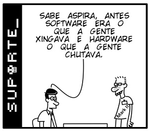

<h1 style="color: #E1BE5A;">FUNDAMENTOS DE<br> COMPUTAÇÃO E<br> ALGORITMOS</h1>

##### Professores: Mário Souto e Edson Ifarraguirre Moreno.


>"Quando você está na computação, pensa muito em problema e solução, mas quando a
>gente vai em uma escola de arte, os artistas expressam uma paixão com algo que eles
>querem expressar".
>**Katia Canepa Vega**

## Ementa da disciplina

- Entendimento de algoritmos e estruturas de dados (listas, filas, pilhas e árvores) na solução de problemas

- Análise de algorítmica quanto a aplicação e complexidade.

- Análise da aplicabilidade e manejo de estruturas de dados lineares e hierárquicas.

## Fundamentos
##### Software e Hardware

- Software consiste em um conjunto de instruções ou programas de computador projetados para realizar tarefas específicas em computadores ou dispositivos eletrônicos. Ele é composto por códigos de programação que permitem que o computador execute uma variedade de funções e operações. A complexidade dos softwares pode variar, desde pequenas aplicações até sistemas operacionais completos que gerenciam recursos e possibilitam a execução de outros programas.

É possível dividirmos os softwares em duas categorias  principais:

**1 - Softwares de Sistema:**
São programas que fornecem funcionalidades fundamentais para o funcionamento de um computador ou dispositivo. Isso inclui sistemas operacionais, drivers de hardware, utilitários de sistema e outros componentes.

**2 - Software de Aplicativos:**
Estes são os programas utilizados pelos usuários finais para realizar tarefas específicas. Eles podem abranger aplicativos de escritório, navegadores da web, editores de imagem, reprodutores de mídia, redes sociais e outras ferramentas.

Os softwares desempenham um papel essencial na tecnologia moderna, possibilitando que as pessoas realizem uma variedade de atividades, desde navegação na internet até a análise de informações complexas.

- Hardware refere-se a parte física de um computador ou dispositivo eletrônico.
  São elementos tangíveis que podem ser tocados e ou manipulados. Isso incluiu desde circuitos eletronicos, processadores, placas-mãe, memória RAM, dispositivos de armazenamento ou
  periféricos como mouse ou teclado.
  O hardware fornece a base física e os recursos necessários para que o software possa funcionar.

 Em conjunto softare e hardware formam os elementos essencias para o funcionamento de qualquer sistema tecnológico, trabalham juntos para fornecer funcionalidades e recursos variados.


  


  ## História
O ENIAC foi o primeiro grande computador eletrônico em larga escala da história. O objetivo era criar uma máquina capaz de realizar cálculos complexos em uma fração de tempo que levaria para um ser humano. Hoje em dia, até o aparelho mais simples possui capacidade superior ao ENIAC, mas na época a monstruosidade de 30 toneladas, com mais de 150 m² de área e com mais de 17 mil válvulas, precisava de nada menos do que 6 (seis) mulheres para realizar a programação.
Era o que existia de mais moderno.

## Como a internet funciona ?
Basicamente a internet é um gigantesca rede de computadores que se cominicam juntos, a espinha dorsal da web, a infraestrutra tecnica que torna a web possível.
Existem dois conceitos fundamentais para o funcionamento da internet: PACOTES E PROTOCOLOS

**- Pacotes**
  Em uma rede, um pacote representa uma pequena parte de uma mensagem mais extensa. Os pacotes possuem tanto dados como informações sobre essas dados.
As informações referentes ao conteúdo do pacote são encapsuladas no que é chamado de cabeçalho, que precede o pacote para que a máquina receptora possa entender como processar o conteúdo.
Ao enviar dados pela internet, estes são fragmentados em pacotes menores, que posteriormente são traduzidos em bits. Os pacotes alcançam seu destino através de vários dispositivos de rede, como roteadores e switches.
Quando chegam ao destino, o dispositivo receptor reorganiza os pacotes na ordem correta, permitindo a utilização ou exibição apropriada dos dados.

**- Protocolos**
  Uma rede não se limita apenas a dois computadores; pelo contrário, existem milhares de computadores conectados à internet.
A internet consiste em uma rede de redes de computadores, e para que a comunicação entre eles seja possível, é necessário que todos falem a mesma "língua".
Esse problema é solucionado através de protocolos padronizados.
Existem protocolos para enviar pacotes na mesma rede (Ethernet), de uma rede para outra (IP), para assegurar que os pacotes cheguem com sucesso e na ordem correta (TCP), bem como para a formatação de dados em aplicativos e sites (HTTP). Além desses, existem protocolos de criptografia, de roteamento e muitos outros.

## Conexão cliente e servidor
Computadores conectados a internet são chamados de clientes e servidores.

**- Cliente**
Cliente é quem inicia a comunicação com o servidor. Um exemplo conhecido de cliente é o navegador web.
Ao acessarmos um site, enviamos pela internet uma requisição ao computador que hospeda esse site em questão.
As aplicações que atuam em nome do usuário são identificadas como "user-agent".
Após o envio da requisição, o user-agent aguarda até receber uma resposta do servidor, momento em que a comunicação é finalizada.
<br>

**- Cliente**
O servidor é quem recebe a requisição e envia de volta uma resposta para o cliente.
Geralmente, os servidores não emitem respostas a menos que os clientes tenham enviado uma requisição prévia.
Um servidor é constituído por um ou mais computadores, cada um com um endereço único, como por exemplo: www.pucrs.br.
Esses servidores podem armazenar vídeos, imagens, documentos, áudios e outros tipos de conteúdo. Com frequência, também hospedam programas que
processam e atendem às solicitações dos clientes. Esses programas são denominados servidores web, ou web servers.
Através do servidor web, estabelecemos comunicação, sendo ele um componente fundamental da infraestrutura da internet.


**- Problema**
  Quando há uma fila de requisições muito extensa aguardando resposta do servidor, pode extrapolar o limite de requisições suportado, resultando em travamento e encerramento das respostas.
  Um dos fatores que agravam esse problema são as novas tentativas de conexão por parte dos usuários, o que, por consequência, leva ao acumulo de requisições não atendidas e à ocorrência do erro 500 (erro interno do servidor).

**- Solução**
  Uma maneira de enfrentar o problema de múltiplos acessos ao sistema ao mesmo tempo é adotar a utilização de dois ou mais sistemas, embora isso exija cuidados devido à complexidade envolvida.
  Outra alternativa seria empregar um balanceador de carga (load balancer), que redistribui parte da carga de um sistema sobrecarregado para outro sistema, dividindo assim a carga.
  
  
  **_Cada solução apresenta vantagens e desvantagens, portanto, é fundamental alinhar-se com os demais setores da empresa para determinar a melhor alternativa a ser adotada._**


## Pensamento Computacional
É importante pensar em como uma função é construída, em um pensamento computacional existe um caminho a seguir oara conduzir uma solução.
A partir da apresentação de um problema, seguimos para a exploração e entendimento das caracteristicas de funcionamento do problema para que, com os
conhecimentos adquiridos e recursos computacionais, possamos traçar caminhos e definir a melhor solução a ser aplicada.
Antes de começar a programar, é importante que se tenha em mente qual é exatamente o problema a ser solucionado, qual a forma de condução da solução e recursos.
<br>
<br>

>**_"Para um problema, existem necessáriamente várias funções que podem ser aplicadas, 
>nem todas são necessariamente boas."_**

## Modularização
A modularização vem da criação de funções dentro do código.
Uma vez chamada essa função, existe um conjunto de comandos associados a essa função, quando executados irão retornar ou não um valor.

## Complexidade Algorítmica
Quando criamos uma solução computacional, muitas veses, é preciso parar e analizar se a solução é a melhor.
Uma solução pode resolver uma problema e não ser necessariamente a melhor para este problema.
Para definir se um algoritmo é eficiente precisa-se avaliar algumas características de espaço ocupado, desempenho e tempo gasto na execução.
A medida de complexidade do algoritmo é a medida de consumo dos recursos com tempo de precessamento, hardware necesário, memória ocupada, etc.

Uma das formas de medir se uma solução é adequada ou não, é o calculo de tempo. Mas a preocupação somente com o tempo pode não ser a melhor forma de analisar.
Pois nosso sistema computacional não está dedicado exclusivamente ao que queremos que ele execute.


## Avaliação de Desempenho
O cálculo de tempo pode não ser a melhor abordagem para avaliar o desempenho de um programa.
Mensurar o melhor, o médio e o pior caso de uso é outra solução. para isso, contamos operações e a partir disso formula-se uma equação para definir qual o melhor compartamento
do algoritmo.
O cálculo consiste em contar quantas operações primítivas são executadas, para diferentes algoritmos teremos diferentes comportamentos.


## Conceitos básicos da linguagem

##### Operadores padrão

```javascript
/*
Operadores Aritméticos

* Adição - representado pelo simbolo de +
* Subtração - representado pelo simbolo de -
* Multiplicação - representado pelo simbolo de *
* Divisao - representado pelo simbolo de /
* Módulo - representado pelo simbolo de %


Operadores de incremento e decremento

* Incremento - representado pelo simbolo de ++
* decremento - representado pelo simbolo de --


Operadores relacionais

* Igual - representado pelo simbolo de ==
* Diferente - representado pelo simbolo de !=
* Menor - representado pelo simbolo de <
* Menor e igual - representado pelo simbolo de <=
* Maior - representado pelo simbolo de >
* Maior e igual - representado pelo simbolo de >=


Operadores Lógicos

* e - representado pelo simbolo &&
* ou - representado pelo simbolo ||
*/

```

##### Declaração de variável

**- var** define uma variável mutável de escopo global.

**- let** define uma variável mutável dentro de um escopo.

**- const** define uma variável IMUTÁVEL dentro de um contexto.

```javascript

var nome = 'Daniel';
let idade = 30;
const cpf = 00099900099;
```

##### Comandos de seleção (if / else / else if)

```javascript

// # # # if - Exemplo : # # #

var nome = 'pedro';

if(nome == 'pedro')
{
  console.log('Olá ' + nome);

};

// else - Exemplo: # # #

var idade = 18;

if(idade >= 18)
{
  console.log('Já pode dirigir');
}
else
{
  console.log('Ainda não pode dirigir');
}


// # # # else if - Exemplo: # # #

var cor = 'amarelo';

if(cor == 'verde')
{
  console.log('SIGA');
}
else if(cor == 'amarelo')
{
  console.log('ATENÇÃO')
}
else
{
  console.log('PARE')
};


// # # # if ternário - Exemplo: # # #
//condição ? caso verdadeiro : caso falso;

var idade = 25;

var resposta = (idade >= 18) ? 'Pode beber' : 'Ainda não';
console.log(resposta);


// # # # switch(condição) -  Exemplo 5: # # #

var numero = 2;
switch(numero)
{
  case 1:
    console.log('é o numero 1');
    break;
  
  case 2:
    console.log('é o numero 2');
    break;
  
  case 3:
    console.log('é o numero 3');
    break;
  
  default:
    console.log('não sou nenhuma das opções anteriores');
    break;
}
```


#### Comandos de repetição (loops)

```javascript

/* Declaração do loop for.
 for([inicialização]; [condição]; [expressão final]){Seu código aqui}

exemplo: */
for(var i = 0; i < 10; i++>)
{
  //seu código aqui
  console.log(i); // 'imprime' o valor de i.
}

/* Declaração do loop while
 while(condição)
{
  seu código aqui / rotina
};

Exemplo: */
let n = 0;
let x = 0;

while(n < 3)
{
  n++;
  x += n;
}

/*
do
{
  seu código aqui
}
while(condição);

Exemplo: */

var result ='';
var i = 0;
do
{
  i += 1;
  result += i + ' ';
}
while(i > 0 && i < 5);

```

#### Criação de funções

```javascript


// função sem parametros
function digaOi()
{
  console.log('oi');
}

// função com parametro
function meuNome(nome)
{
  console.log('Bem vindo '+nome)
}

```

## Array
Uma das estruturas de dados padrões para linguagens é o array, que armazena dados de forma contínua na memória.
Ele facilita percorrer os dados armazenados e evita a criação de multiplas variáveis que possuem a mesma finalidade.
Por ser um recurso indexado o array permite acessar elementos individuais dentro dele.
<br>
O conjunto de elementos que podem ser explorados na elaboração utilizando array são: length, push, pop, unshift, splice, slice, at(pos) ou [pos], etc.
A partir do array e seus métodos é possível construir pilhas e filas.
Para as pilhas são necessários somente dois métodos, o push e o pop. No caso da fila utilizamos push e shift.

```javascript
//Criando um array vazio.
const meuArray = [];


//Criando um array com elementos.
const carros =["fusca", "gol", "passat", "opala", "maverick", "corcel"];


//Criando um array de números.
const numeros = [1, 2, 3, 4, 5];


//Criando array com tipos diferentes
const misturado = ["texto", 123, true, ["subarray", "dentro", "do", "array"]];

//criando array usando função construtora
const outroArray = new Array("primeiro", "segundo", "terceiro");

```

## Tipos derivados de Array

Explora estrutura de dados de Array
Útiliza métodos específicos do Array que garantem comportamento adequado


- Pilha
	Último dado a entrar é o primeiro a sair(LIFO)
	push e pop
	  
```javascript

  class Pilha
  {
    constructor() {
      this.items = [];
    }

    // Adiciona um elemento ao topo da pilha
    push(element) {
      this.items.push(element);
    }

    // Remove e retorna o elemento do topo da pilha
    pop() {
      if (this.isEmpty()) {
        return "A pilha está vazia";
      }
      return this.items.pop();
    }

    // Retorna o elemento do topo da pilha, sem removê-lo
    peek() {
      if (this.isEmpty()) {
        return "A pilha está vazia";
      }
      return this.items[this.items.length - 1];
    }

    // Verifica se a pilha está vazia
    isEmpty() {
      return this.items.length === 0;
    }

    // Retorna o tamanho da pilha
    size() {
      return this.items.length;
    }

    // Limpa a pilha
    clear() {
      this.items = [];
    }
  }

    // Exemplo de uso
  const pilha = new Pilha();
  pilha.push("Primeiro");
  pilha.push("Segundo");
  pilha.push("Terceiro");

  console.log("Tamanho da pilha:", pilha.size());
  console.log("Elemento no topo:", pilha.peek());

  console.log("Removido:", pilha.pop());
  console.log("Tamanho da pilha:", pilha.size());
  
```

- Fila
	Primeiro dado a entrar é o primeiro a sair(FIFO)
	push e shift

```javascript


class Fila {
  constructor() {
    this.items = [];
  }

  // Adiciona um elemento ao final da fila
  enqueue(element) {
    this.items.push(element);
  }

  // Remove e retorna o primeiro elemento da fila
  dequeue() {
    if (this.isEmpty()) {
      return "A fila está vazia";
    }
    return this.items.shift();
  }

  // Retorna o primeiro elemento da fila, sem removê-lo
  front() {
    if (this.isEmpty()) {
      return "A fila está vazia";
    }
    return this.items[0];
  }

  // Verifica se a fila está vazia
  isEmpty() {
    return this.items.length === 0;
  }

  // Retorna o tamanho da fila
  size() {
    return this.items.length;
  }

  // Limpa a fila
  clear() {
    this.items = [];
  }
}

// Exemplo de uso
const fila = new Fila();
fila.enqueue("Primeiro");
fila.enqueue("Segundo");
fila.enqueue("Terceiro");

console.log("Tamanho da fila:", fila.size());
console.log("Primeiro elemento:", fila.front());

console.log("Removido:", fila.dequeue());
console.log("Tamanho da fila:", fila.size());

```

## Conjuntos(set)
- Estrutura de dados simples como array
   - Também armazena dados de forma contigua na memória
- Não armazena dados duplicados.
- Disponibiliza operações básicas de conjuntos


```javascript

// Criando um conjunto
const meuSet = new Set();

// Adicionando elementos ao conjunto
meuSet.add("Maçã");
meuSet.add("Banana");
meuSet.add("Laranja");
meuSet.add("Maçã"); // Elemento duplicado não será adicionado

// Verificando o tamanho do conjunto
console.log("Tamanho do conjunto:", meuSet.size); // Saída: 3

// Verificando se um elemento está presente no conjunto
console.log("Contém Banana:", meuSet.has("Banana")); // Saída: true
console.log("Contém Uva:", meuSet.has("Uva")); // Saída: false

// Removendo um elemento do conjunto
meuSet.delete("Laranja");

// Iterando pelos elementos do conjunto
console.log("Elementos do conjunto:");
for (const elemento of meuSet) {
  console.log(elemento);
}

// Limpando o conjunto
meuSet.clear();
console.log("Tamanho do conjunto após limpar:", meuSet.size); // Saída: 0


//Use para remover elementos duplicados de um Array
const numeros = [2, 3, 4, 4, 2, 3, 3, 4, 4, 5, 5, 6, 6 ,7 ,5 ,32, 3, 4, 5];
console.log([...new Set(numeros)]);

```


## Dicionários (Maps)

- Estrutura de dados simples como Array
	- Também armazena dados de forma contígua na memória
- Diferente de array, armazena a informação a partir de um par
	- Chave + valor
	- Chaves
		- Não se repetem
	- Valores
		- Podem ser duplicados
		- Aceita qualquer tipo de dado
	- Requer uso dos métodos
		- Interage com a estrutura

```javascript

// Criando um mapa
const meuMapa = new Map();

// Adicionando elementos ao mapa
meuMapa.set("chave1", "Valor 1");
meuMapa.set("chave2", "Valor 2");
meuMapa.set("chave3", "Valor 3");

// Verificando o tamanho do mapa
console.log("Tamanho do mapa:", meuMapa.size); // Saída: 3

// Obtendo um valor usando uma chave
console.log("Valor da chave2:", meuMapa.get("chave2")); // Saída: "Valor 2"

// Verificando se uma chave está presente no mapa
console.log("Contém chave1:", meuMapa.has("chave1")); // Saída: true
console.log("Contém chave4:", meuMapa.has("chave4")); // Saída: false

// Removendo um par chave-valor do mapa
meuMapa.delete("chave3");

// Iterando pelos pares chave-valor do mapa
console.log("Pares chave-valor do mapa:");
for (const [chave, valor] of meuMapa) {
  console.log(chave, valor);
}

// Limpando o mapa
meuMapa.clear();
console.log("Tamanho do mapa após limpar:", meuMapa.size); // Saída: 0


```