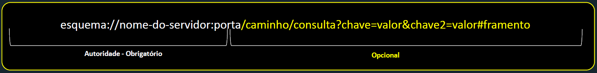

<h1 style="color: #E1BE5A;">ARQUITETURA  CLIENT-SIDE</h1>

##### Professores: André Luiz Mendes Pereira e Júlio Henrique Araújo Pereira Machado.

>"Nenhum software é **100% seguro"**.  
>**<i>Daniel Callegari</i>**

 

## Ementa da disciplina

- Estudo de Arquitetura cliente-servidor para aplicações web SPAs (Single Page Applications).

- Estudo sobre frameworks cliente-side:
- React,
- Next.js,
- Redux,
- React Router,
- React Hook Form,
- Jest,
- Styled Components.

------------

#### Introdução

A arquitetura Client-Side é composta por 3 grandes partes:
-   Camada de frontend
    -   Paginas web
    -   Aplicativos móveis
-   Camada middleware
    -   Protocolos de rede
    -   Redes
-   Camada de backend
    -   Serviços
    -   Servidores

Essas camadas se interligam e proporcionam convergências que impulsionam a arquitetura moderna, como mobilidade, internet das coisas, redes sociais, arquitetura de infraestrutura em nuvem e arquitetura de análise.
A terceira plataforma, resultando dessa convergência, lida com bilho~es de usuários, centenas de milhares de aplicativos e serviços em nuvem,
promovendo a transparência e a distribuição dos sistemas. A arquitetura de software dentro desse contexto, busca suportar decisões técnicas para a construção harmoniosa de software, considerando o ambiente, contexto e modelo de negócio.

#### Padrões e elementos
Os principais **padrões arquiteturais são o de três camadas**, que envolve a comunicação entre camadas.
A arquitetura limpa(onion architecture), que estabelece a estrutura em camadas seguindo um roteiro de comunicação; a arquitetura hexagonal, que utiliza adaptadores de entrada e saída para interagir com o mundo externo.
Além disso, é importante considerar o contexto, tempo e cultura da empresa na escolha da arquitetura a ser implementada.
Os elementos da arquitetura client-side incluem dispositivos diversos, plataformas ( como browsers e sistemas operacionais), mensageria (chatbots) e design system, que auxilia na criação de produtos consistentes e com ID visual.

#### Sistemas distribuidos
Um sistema distribuído é um conjunto de dispositivos / serviços independentes que se apresentam a seus usuários, programas ou outros serviços como um sistema único e coerente utilizando-se de um sistema de conexão.

**Uma "meta" importante no sistema distribuído é a transparência.**

Esta transparência remete em ocultar do demandardor(EX: usuário) a representação do dado, protocolos, autenticação entre serviços, localização, relocação de recursos, migraçoes, concorrências e falas.

Para minimizar os impactos em prol deste "ocultismo" para sistemas web, utiliza-se de boas estratégias como um bom design system, coerência no planejamento arquitetural(client-side e server-side), e o uso de ferramentas adequadas, é vital para o sucesso de projetos com foco no frontend.

#### Arquitetura de software
 A arquitetura de software tem por objetivo suportar a tomada das decisões técnicas.
 é uma extrutura complexa que compreende decisões arquiteturais sobre elementos estruturais, softwares e modelagem buscando gerar harmonia na construção de software, levando em consideração o ambiente e contexto(estrutura da empresa, cultura, cronogramas, etc...).

 **Elementos da arquitetura de software:**
 -  Princípios do Design
    -  São diretrizes para a construção do sistema.
    -  EX princicios do design: DDD (domain drive design)
 -  Características
    -  Operacional
       -  Disponibilidade
       -  Desempenho
       -  Resiliência
       -  Segurança
       -  Robustez
       -  Escalabilidade
    -  Estrutural
       -  Manuntenabilidade
       -  Implantabilidade
       -  Confiabilidade
       -  Observabilidade
       -  Capacidade de atualização
       -  Performance
       -  Disponibilidade, etc...
    -  Transversal
       -  Acessibilidade
       -  Armazenamento
       -  Autorização
       -  Privacidade
       -  Segurança
       -  Usabilidade
 -  Estrutura Arquitetural
    -  é Uma abordagem de como projetar e entregar uma aplicação.
    -  EX:
       -  Camadas
       -  Microserviços
       -  REST
       -  Monolítica 
 -  Decisões Arqueteturais
    -  São estratégias de alto nível para ajudar a definir a responsabilidade dos componentes do sistema.
    - EX:
      - Onion architeture
      - CQRS
      - Hexadecimal ou Adpters

#### Qual arquitetura implementar ?
Não existe uma arquitetura única que funcione em todos os casos.
Deve-se personalizar suas arquiteturas para suas necessidades, aplicando padrões que resolvam problemas e se adaptem melhor às situações.

**Reflexão**
Microserviços ou microfrontends são estilos arquiteturais e não uma arquitetura.
Técnicas como DDD(domain driven design) podem ajudar na modelagem da arquitetura, na definição de estilos e padrões e nos requisitos arquiteturais.
EX: orquestar microserviços e microfrontends.

#### Arquitetura client-side
É importante considerar o contexto, o sistema e os componentes ao projetar uma aplicação.
Elementos como CSS, HTML e Javascript, desempenham papéis essenciais na construção de interfaces web interativas.
Aspectos como meta tags, influenciam a forma como o conteúdo é apresentado em mecanismos de busca e em compartilhamentos em redes sociais.
Esses elementos são essencias para a arquitetura frontend e experiência do usuário.

#### Design System
Envolve todo o contexto de estilos, padrões, componentes, ferramentas e bibliotecas que devem auxiliar equipes e projetar e construir um produto. Mantendo um padrão visual com base em UX/UI auxiliando inclusive requisitos como usabilidade e acessibilidade.
Ao compartilhar artefatos de design, evita-se reinventar a roda, reutilizando código de design e aumentando a produtividade.

#### URI - URL - URN

##### URI - Uniform Resource Identifier:
Padrão para endereçamento de recursos disponíveis na web que engloba conceitos de:

**Tipos de URI:**
-   URL - Uniform Resource Locator
-   URN - Uniform Resource Name

##### URL
Refere-se a um subconjunto de URIs que serve para referenciar um recurso e sua localização na rede, normalmente a internet.

**Estrutura de uma URL**
-   Esquema
    -   Identifica a forma de interação entre um cliente e servidor
    -   EX: http - https - ftp
-   Nome do servidor
    -   Nome ou número IP onde se encontra a aplicação servidor.
-   Porta
    -   Identifica a porta TCP/IP associada ao servidor. No caso padrão do HTTP, a porta é 80 e pode ser omitida.
-   Caminho
    -   Indica o local exato onde o recurso se encontra
-   Consulta
    -   Dados não hierárquicos que detalham uma consulta normalmente sob chaves e valores.
-   Fragmento
    -   Identifica uma seção no recurso.

##### URN
É um padrão de URI que não indica qual protocolo deve ser utilizado para localizar e acessar um recurso.
O objetivo do URN é permitir a separação entre a identificação(nome único) e localização(idenfificado). Permitindo acesso a uma identidade do dado mesmo com mudança da localização do servidor.

Cada instituição pode propor o formado da URN.

#### CDN
CDN ou redes de distribuição de conteúdo são redes de servidores otimizados para entrega de conteúdo estáticos ou dinâmicos mais rapidamente ao usuário.
Armazenam conteúdos cacheáveis, pois relativamente o conteúdo chegará mais rápido.

**Tipo de conteúdos:**
-   Estáticos
    -   Mudam raramente ou nunca.
    -   EX: Imagens, vídeos, pdfs, bibliotecas JS, css, html, etc
    -   TTL EX: 6 meses / 1 ano
-   Dinâmicos
    -   Mudam com frequência
    -   EX: resposta de API,  pagina home, feed
    -   TTL EX: 5 segundos

**TTL - time to live**

#### Serviços na web - evolução

##### Monolitos - empresas tradicionais
Necessidade de TI mais moderna e eficiente além da fronteira dos processos e departamentos precisa integrar sistemas diferentes

##### Serviços - SOA - Arquitetura Orientada a Serviços
Surge conceit de serviços digitais para:
-   Compartilhamento de recursos
-   Interoperabilidade
-   Reutilização
-   Acoplamento
-   Otimização

##### WebServices, Microserviços, Eventos - Transformação Digital
Transformação digital exponenciada.
Surge necessidade de consumir serviços mais específicos até funcionalidades específicas.
Atender não só o SOA mas outras abordagens arquiteturais.

#### Escalabilidade - serviços

##### O que são serviços ?
São recursos de software que disponibilizam funcionalidades através da web.
Essas funcionalidades são expostas através de uma interface de programação de aplicativos (API) que permite que outra aplicações se comuniquem e interajam com o serviço.

##### Webservices e APIs REST
Web Service é uma categoria específica de APIs que segue padrões e protocolos específicos para permitir a interoperabilidade entre distemas distribuídos, enquanto APIs são interfaces mis amplas que podem ser usadas para diferentes propósitos e contextos de integração e interação de software.

#### Renderização
Em tecnologias frontend refere-se ao processo de exibir e atualizar visualmente os elementos de uma interface de usuário em um dispositivo, utilizando um navegador web ou em um aplicativo móvel.
É a maneira como os dados são convertidos em elementos visuais que os usuários podem ver e interagir.

Existem dois tipos de renderização na arquitetura client-side:
-   CSR - client side rendering
-   SSR - server side rendering

#### Abordagens de Desenvolvimento

##### SPA - Single Page Application
São muito adotados na atulidade, permitem que desenvolvedores criem paginas ricas, responsívas e interativas.
Iniciou com o uso de AJAX e códigos JS complexos mas hoje fazem o uso de frameworks para simplificar o processo.
A adesão de frameworks como React, Angular, Vue foram essenciais para a aceleração do desenvolvimento e fornecem recursos para rereutilizaçao de código.
Toda SPA faz o trabalho de renderização no lado do cliente, mas nem toda aplicação que faz esse trabalho é uma SPA.

**SPA são CSR(client side rendering)**

##### Mobile First
É um conceito que prioriza a criação de sites e sistemas primeiro para dispositivos móveis e depois para os demais.
no ínicio, mesmo com padronização, o desenvolvimento era complexo pois exigia linguagens de software específicas para códigos nativos.
Kotlin e Swift foram os mais populares.

##### PWA - Progressive WebApp
Permitem criar aplicações web, normalmente SPA, acessadas via browser que utilizam recursos nativos do dispositivo como cameras, biometria, até mesmo notificações.
PWA unifica vantagens do desenvolvimento nativo com aplicações web responsivas.

**PWA - Service Worker**
Pode-se dizer que é o coração da PWA.
Dentre outras coisas permite que o app trabalhe offline, interagir com usuario mesmo fechado, enviar notificações, usar recursos nativos como câmeras, biometria e diversas APIs próprias para uso.
O Service Worker insere uma nova camada na aplicação cliente-servidor, ele se apresenta como uma ponte na comunicação, interceptando todas as chamadas.
É como se fosse uma extensão do navegador trabalhando como intermediário.

#### Frameworks
Frameworks de desenvolvimento frontend são conjuntos de ferramenta, bibliotecas e padrões de código que facilitam a criação de interfaces de usuário interativas e resposnivas em apicativos web.
Como vantagem ajuda a agilizar o desenvolvimento de software. Eles fornecem uma estrutura básica e consiste para o desenvolvimento, permitindo que os desenvolvedores se concentrem na lógica de negócios do aplicativo e menos em configurar detalhes de baixo nível de execução.

**Vantagens:**
-   Código
-   Agilidade
-   Compatibilidade
-   Responsividade

**Desvantagens:**
-   Curva de aprendizado
-   Restrições
-   Sobrecarga
  
  **PRINCIPAIS FRAMEWORKS DA ATUALIDADE:**
1.  React
2.  Vue.js
3.  Next.js
4.  Angular
5.  Svelte
6.  Ember.js

  **FRAMEWORKS MULTIPLATAFORMA:**
1.  React Native
2.  Flutter
3.  Xamarin
4.  Ionic

#### Micro Serviços
São uma abordagem arquitetural para o desenvolvimento de software, na qual uma aplicação é dividida em componentes independentes, isolados.
Micro-serviços permitem buscar escala, maior produtividade, manutenibilidade, melhores teste, agilidade na implantação e etc...

