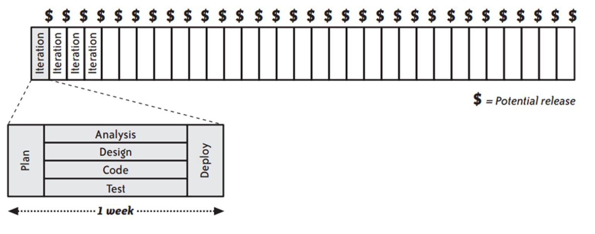

<h1 style="color: #E1BE5A;">TÉCNICAS ÁGEIS DE PROGRAMAÇÃO</h1>

##### Professores: Daniel Wildt, Guilherme Lacerda e Michael da Costa Móra

>"Economizar tempo e esforço de um usuário vai me trazer  
>muito mais benefícios do que tentar economizar em 
><i>**processamentos ou armazenamento."**</i> 
>**<i>Luana Muller</i>**

 

## Ementa da disciplina

- Fundamentos da agilidade
- Panorama das meotodologias ágeis
- Extreme programming
- Test driven development(TDD)
- Behaviour driven design(BDD)
- BDD x TDD 
------------
 

#### princípios
-   Satisfazer o client, entregando o sftware em tempo hábil e continuamente
-   Aceitar as mudanças de requisitos, em qualquer fase do projeto
-   Etregar software na menor escala de tempo possível
-   Equipe de desenvolvimento e cliente são do mesmo time
-   Construir projetos com indivíduos motivados e comprometidos com o resultado.
-   Uasr comunicação efetiva
-   Ter o software em funcionamento é a principal medida de progresso
-   Atenção contínua à excelencia técnica
-   As melhores arquiteturas , requisitos e projetos provêm de equipes organizadas
-   Refletir sobre como se tornar mais eficaz, ajustando e adaptando o comportamento da equipe.

**Simplicidade - a arte de maximizar a quantidade de trabalho não realizado - é essencial.**

#### O desenvolvimento de software.

<table>
  <thead>
    <tr>
      <th colspan="6">(a) Watterfall lifecycle</th>
      <th colspan="1">$</th>
    </tr>
  </thead>
  <tbody>
    <tr>
      <td>Plan</td>
      <td>Analysis</td>
      <td>Design</td>
      <td>Code</td>
      <td>Test</td>
      <td>Deploy</td>
    </tr>
    <tr>
      <th colspan="6"><====    3 ~ 24 meses    ====></th>
    </tr>
  </tbody>
</table>

<table>
  <thead>
    <tr>
      <th colspan="6">(a) Iterative lifecycle</th>
      <th colspan="1">$</th>
      <th colspan="6"></th>
      <th colspan="1">$</th>
      <th colspan="6"></th>
      <th colspan="1">$</th>
    </tr>
  </thead>
  <tbody>
    <tr>
      <td>Plan</td>
      <td>Analysis</td>
      <td>Design</td>
      <td>Code</td>
      <td>Test</td>
      <td>Deploy</td>
      <td> </td>
       <td>Plan</td>
      <td>Analysis</td>
      <td>Design</td>
      <td>Code</td>
      <td>Test</td>
      <td>Deploy</td>
      <td> </td>
       <td>Plan</td>
      <td>Analysis</td>
      <td>Design</td>
      <td>Code</td>
      <td>Test</td>
      <td>Deploy</td>
      <td> </td>
    </tr>
    <tr>
      <th colspan="6"><====    1 ~ 3 meses    ====></th>
      <th colspan="1"> </th>
      <th colspan="6"><====    1 ~ 3 meses    ====></th>
      <th colspan="1"> </th>
      <th colspan="6"><====    1 ~ 3 meses    ====></th>
      <th colspan="1"> </th>
    </tr>
  </tbody>
</table>

**$ = Potential release**

#### Desenvolvimento Ágil

 

 #### Engenharia
Assim como a gestão, a engenharia precisou se renovar

-   Conjunto de práticas e ferramentas para apoiar o processo.
    -   Automações (testes, tarefas, processos)
    -   Refatoração e heurísticas de limpeza
    -   Revisões de código
    -   Princípios de Design

**ENTENDA - software é um produto.**

#### Conceito 3C

-   Cartão:
    -   Informação limitada, opera como um lembrete
-   Conversação:
    -   Quem nos ajuda a amplificar o conhecimento e desenvolver exemplos sobre o que estamos aprendendo ?
-   Confirmação:
    -   Conforme conversamos com clientes conseguimos comprovar os atendimentos, atráves de validação com o mundo real.

#### Spike Solution

-   Aprenda antes, para depois poder descobrir e habilitar a entrega
-   Tempo de investigação
-   Preparação para o fazer
-   Remoção de risco técnico
-   Modo descoberta e modo entrega

#### Ritmo sustentável
-   Como funciona sua vida?
-   Qual tempo existe para você?
-   Quando você aprende?
-   Quando você não faz nada?

Ritmo sustentável trata de tempo de presença, tempo de foco.
Horas extras ? Eventualmente irá ocorrer. Você vai assumir por entender sua responsabilidades.

#### O trabalho da pessoa desenvolvedora
-   Principais Atividades
    -   Design / Programação / Testes / Manutenção / Evolução
    -   Gestão de configuração e do trabalho
    -   Colaborar com outros profissionais
-   Desafios
    -   Dominar tecnologia(s)
    -   manter-se atualizada(o)
    -   Ter a visão do todo
    -   Ser especialista / generalista
    -   Interagir com clientes / usuários
    -   Preocupar-se constantemente com a qualidade
    -   Se adaptar!

#### Testes de software

<table>
  <thead>
    <tr>
      <th colspan="1">Slower</th>
      <th colspan="1"> </th>
      <th colspan="1">Faster</th>
    </tr>
  </thead>
  <tbody>
    <tr>
      <td>UI Tests</td>
      <td>Service Tests</td>
      <td>Unit Test</td>
    </tr>
        <tr>
      <th colspan="1">More  integration</th>
      <th colspan="1"> </th>
      <th colspan="1">More  isolation</th>
    </tr>
    
  </tbody>
</table>

#### Testes ou Design?
-   Nossos testes automatizados representam nosso design
-   Que estruturas precisamos para resolver o problema?
-   Quais limites e restrições que o problema de negócio nos impõe?

#### A importância das perguntas
-   Como sabemos que terminamos a nossa tarefa?
-   Como sabemos que estamos preparados para iniciar?

**A importância dos critérios de aceite!**
-   Ajudam a cadenciar o trabalho
-   Ajudam a fazer somente o necessário(just enough)
-   Cenários demonstram exemplos que definem os limites do nosso trabalho.

#### Automação e Integração Contínua
-   Você mantem seu código na sua máquina por quanto tempo?
-   Se seu código entrar na base de produção, vai quebrar alguma coisa?
-   Como o seu código chega até quem vai usar e gerar valor a partir da sua entrega?
-   Como funcionam os builds da sua equipe?

#### Pipeline

Pipeline de Entrega
<table>
<tr>
<td>Ideia</td>
<td> </td>
<td>Código</td>
<td>Testes</td>
<td>pacote</td>
<td>Servidores Ambientes</td>
<td>Exploração Homologação Aprovação</td>
<td>Implantar</td>
<td> </td>
<td>Em produção</td>
</tr>
</table>

 

<table>
<tr>
<td>Em Produção</td>
<td> </td>
<td>monitoramento</td>
<td>Alertas</td>
<td>Suporte</td>
<td>Dados Análises</td>
<td>Feddback dos usuários</td>
<td>Insights</td>
<td> </td>
<td>Ideia</td>
</tr>
</table>

#### Integração, Deploy e Entrega Contínua

**Continuous Integration**

<table>
<tr>
<td>Build</td>
<td>auto -></td>
<td>Unit Tests</td>
<td>auto -></td>
<td>Deploy to stage</td>
<td>auto -></td>
<td>Acceptance Tests</td>
</tr>
</table>

**Continuous Delivery**

<table>
<tr>
<td>Build</td>
<td>auto -></td>
<td>Unit Tests</td>
<td>auto -></td>
<td>Deploy to stage</td>
<td>auto -></td>
<td>Acceptance Tests</td>
<td>Manual -></td>
<td>Deploy to production</td>
</tr>
</table>

**Continuous Deployment**

<table>
<tr>
<td>Build</td>
<td>auto -></td>
<td>Unit Tests</td>
<td>auto -></td>
<td>Deploy to stage</td>
<td>auto -></td>
<td>Acceptance Tests</td>
<td>auto -></td>
<td>Deploy to production</td>
</tr>
</table>

#### Cenários e Testes
-   Os testes ajudam a validar nosso progresso
-   Cenários representam **Exemplos** reais de clientes
-   Use perguntas para guiar a construção:
    -   **Dado que?** Em que estado está o sistema, para iniciarmos o trabalho? Qual a **pré-condição?**
    -   **Quando?** Qual **ação** está acontecendo no sistema?
    -   **Então?** Como ficou o sistema depois da ação realizada? O que é esperado? Qual foi a **reação** do sistema?

**NEGÓCIO X TESTE:**
**Dado** que um produto tem estoque disponível
**Quando** informo uma venda inferior ao estoque
**Então** a venda é registrada
E o estoque é atualizado

**Dado** que o estoque da Colca_cola é 50 unidades
**Quando** informo uma venda de 28 unidades
**Então** a venda é registrada
E o estoque passa a ser de 22 unidades.

**Narrativa (Quem? / o que? / Por quê?)**
**Sendo** um <persona>
**Posso** <funcionalidade>
**Pois assim** <benefício>

**Critérios de Aceitação (Como?)**
**Dado** que <pré-condição>
**Quando** <ação>
**Então** <reação>

#### O ritmo do TDD
-   Nosso **progresso de trabalho** acontece de cenário de teste em cenário de teste a ser construído.
-   Quando um **teste não passa** você tem oportunidade de modificar **comportamento.**
-   Quando seus **testes passam,** você tem oportunidade de modificar a **estrutura.**

>"Grande parte do dinheiro gasto com 
>desenvolvimento de software é usado 
>para entender códigos existentes" 
><i>**Kent Beck**</i> 

#### Para refletir
Quanto tempo você leva para "aprender" sobre o repositório de código que você trabalha?
E se trocar de empresa, em quanto tempo você consegue efetivamente "colocar a mão na massa"?

#### Por que analisar código é importante?
- **Ampliar** nossa **capacidade cognitiva** de programação.
- **Conhecer** outros **paradigmas, padrões e linguagens** (e **problemas** também!)
- **Ampliar** nossas **habilidades**

#### Quais habilidades precisamos desenvolver?
- Conhecer **heurísticas de análise para as estruturas**
  - Módulos / pacotes
  - Classes
  - Métodos
- Compreender aspectos de **qualidade de software**
  - Atributos externos e internos
- Aplicar **métricas** de análise, estratégias de **visualização e ferramentas de apoio**
  - Compreensão de software, mineração de repositórios
- Estratégias
  - Análise estática
  - Análise dinâmica
  - Análise temporal
  - Análise comportamental

#### Pilares da Análise
- Coesão
- Acomplamento
- Tamanho
- Complexidade

#### Essência da Análise: Legibilidade e Compreensão

- Estruturas **pequenas**
- Nomes **significativos**
- **Formatação** e uso de padrões(code conventions)
- **Organização** das estruturas e algoritmos
- Aplicação dos **princípios do paradigma**
- **Testes** automatizados.

#### Um Kata para Análise de Código.
- Você pode começar de **"dentro para fora"**
  - Analise as funções / métodos, suas estruturas e design.
  - Considere os pilares
  - Suba a granularidade, quando necessário.

#### Quando o melhor momento para fazer as análises?
- **Sempre!!**
  - E de forma antecipada e quando possível
- **Individualmente,** antes de fazer commits
  - Inspeção na fonte(Poka-yoke, do Lean)
  - Apoiado por ferramentas(Jidôka, do Lean)
- **Em par,** para discutir situações específicas
- Em sessões de **Code Rewiew**

